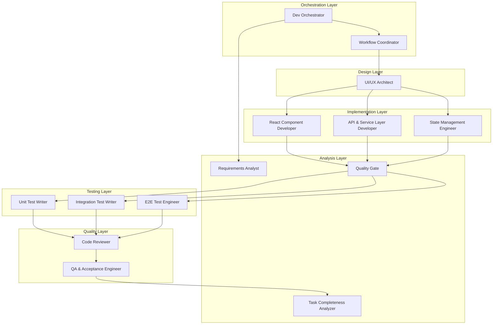
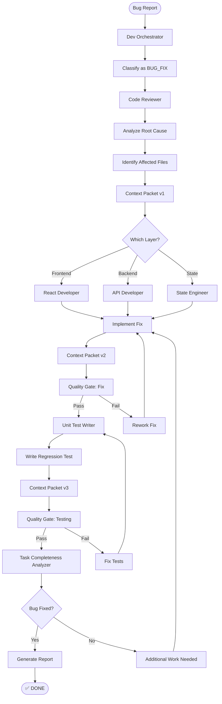

# AI Agent Orchestration - Complete Guide

## Table of Contents
- [Agent Overview](#agent-overview)
- [Agent Types and Responsibilities](#agent-types-and-responsibilities)
- [Task Classification](#task-classification)
- [Workflow Patterns](#workflow-patterns)
- [Context Packet Structure](#context-packet-structure)
- [Quality Gates](#quality-gates)
- [Handoff Protocols](#handoff-protocols)
- [Agent Communication](#agent-communication)
- [Failure Handling](#failure-handling)
- [Best Practices](#best-practices)

---

## Agent Overview

### What are AI Agents?

**AI Agents** in this system are specialized autonomous units that perform specific software development tasks. Each agent has expertise in a particular domain and can work independently or as part of a coordinated workflow.

### Agent Architecture



### Key Principles

#### 1. Specialization
- Each agent has a narrow, well-defined responsibility
- Deep expertise in specific domain
- Produces consistent, high-quality outputs

#### 2. Autonomy
- Agents make decisions within their domain
- No human intervention needed during execution
- Self-validating outputs

#### 3. Collaboration
- Agents pass structured context to each other
- Clear handoff protocols
- Synchronization points for parallel work

#### 4. Quality-First
- Quality gates between major phases
- Automated validation
- Rework loops for failures

---

## Agent Types and Responsibilities

### 1. Dev Orchestrator

**Role:** Entry point and coordinator of all development work

**Responsibilities:**
- Classify incoming tasks
- Select appropriate workflow pattern
- Build initial context packet
- Route to specialist agents
- Enforce quality gates
- Produce final delivery report

**Triggers:**
- All new development requests
- Any task from the user

**Input:**
```yaml
User request: "Add user rating feature"
```

**Output:**
```yaml
Task Classification: FULL_FEATURE
Workflow Pattern: Sequential + Parallel
Context Packet: Initialized
Routed to: Requirements Analyst
```

**Example:**
```
User: "Fix the bug where users can book their own routes"

Orchestrator:
1. Classifies as: BUG_FIX
2. Selects pattern: Targeted Sequential
3. Creates context packet with bug description
4. Routes to: Code Reviewer (for root cause analysis)
```

---

### 2. Requirements Analyst

**Role:** Analyze requirements and create user stories

**Responsibilities:**
- Break down features into user stories
- Write acceptance criteria
- Define constraints and edge cases
- Identify missing requirements

**Triggers:**
- FULL_FEATURE tasks
- DESIGN_ONLY tasks
- Ambiguous requirements

**Input:**
```yaml
Task: "Add user rating system"
Context: Carpooling platform
```

**Output:**
```yaml
User Stories:
  US-001: As a traveler, I want to rate publishers after trips
  US-002: As a publisher, I want to see my average rating
  US-003: As a user, I want to view someone's ratings before booking

Acceptance Criteria:
  US-001:
    - Given trip is completed
    - When I view my booking
    - Then I see a "Rate" button
    - And I can select 1-5 stars
    - And I can write optional review text
  
Constraints:
  - Can only rate after trip datetime has passed
  - One rating per booking
  - Ratings are immutable once submitted
  - Rating affects user reputation score

Edge Cases:
  - Trip cancelled (no rating)
  - Mutual ratings (publisher rates traveler)
  - Anonymous ratings vs named
```

---

### 3. UI/UX Architect

**Role:** Design component hierarchy and UI specifications

**Responsibilities:**
- Define component structure
- Specify visual states
- Design user interactions
- Create responsive layouts

**Triggers:**
- After Requirements Analyst
- DESIGN_ONLY tasks
- UI-heavy features

**Input:**
```yaml
User Story: US-001 (Rate trip feature)
Acceptance Criteria: [...]
```

**Output:**
```yaml
Component Specs:
  RatingForm:
    Props:
      - bookingId: number
      - onSuccess: () => void
    States:
      - stars: 1-5
      - review: string
      - loading: boolean
      - error: string | null
    Visual States:
      - Initial (form ready)
      - Submitting (loading spinner)
      - Success (confirmation message)
      - Error (error message displayed)
    
  RatingDisplay:
    Props:
      - userId: number
      - showDetails: boolean
    Data:
      - average: number (0-5)
      - total: number (count)
      - recent: Rating[] (last 5)

Component Hierarchy:
  MyBookings
    └── BookingCard
        ├── RatingForm (if past trip)
        └── RatingDisplay (publisher info)

Wireframe:
  ┌────────────────────────────┐
  │ Rate Your Trip             │
  ├────────────────────────────┤
  │ How was your experience?   │
  │ ★ ★ ★ ★ ★  (5/5)          │
  │                            │
  │ [Review text area]         │
  │                            │
  │ [Cancel] [Submit Rating]   │
  └────────────────────────────┘
```

---

### 4. React Component Developer

**Role:** Implement React components

**Responsibilities:**
- Build components per specs
- Implement state management
- Handle user interactions
- Ensure type safety with TypeScript

**Triggers:**
- After UI/UX Architect
- Component-related tasks

**Input:**
```yaml
Component Spec: RatingForm
Props: { bookingId, onSuccess }
States: { stars, review, loading, error }
Visual States: [...]
```

**Output:**
```typescript
// RatingForm.tsx
import React, { useState } from 'react';
import api from '../api/axios';

interface Props {
  bookingId: number;
  onSuccess: () => void;
}

export default function RatingForm({ bookingId, onSuccess }: Props) {
  const [stars, setStars] = useState(5);
  const [review, setReview] = useState('');
  const [loading, setLoading] = useState(false);
  const [error, setError] = useState<string | null>(null);

  const handleSubmit = async (e: React.FormEvent) => {
    e.preventDefault();
    setLoading(true);
    setError(null);

    try {
      await api.post(`/api/bookings/${bookingId}/rate`, {
        stars,
        review
      });
      onSuccess();
    } catch (err: any) {
      setError(err.response?.data?.error || 'Rating failed');
    } finally {
      setLoading(false);
    }
  };

  return (
    <form onSubmit={handleSubmit}>
      <h3>Rate Your Trip</h3>
      
      <div>
        <label>Rating:</label>
        <div>
          {[1, 2, 3, 4, 5].map(n => (
            <button
              key={n}
              type="button"
              onClick={() => setStars(n)}
              style={{ 
                fontSize: 24, 
                color: n <= stars ? 'gold' : 'gray' 
              }}
            >
              ★
            </button>
          ))}
        </div>
      </div>

      <div>
        <label>Review (optional):</label>
        <textarea
          value={review}
          onChange={e => setReview(e.target.value)}
          placeholder="Share your experience..."
        />
      </div>

      {error && <div style={{ color: 'red' }}>{error}</div>}

      <button type="submit" disabled={loading}>
        {loading ? 'Submitting...' : 'Submit Rating'}
      </button>
    </form>
  );
}
```

---

### 5. API & Service Layer Developer

**Role:** Implement backend APIs and business logic

**Responsibilities:**
- Create API endpoints
- Implement service layer functions
- Handle validation and errors
- Database interactions

**Triggers:**
- After UI/UX Architect (parallel with React Dev)
- Backend-heavy features

**Input:**
```yaml
Feature: User ratings
Endpoints needed:
  - POST /api/bookings/:id/rate
  - GET /api/users/:id/ratings
```

**Output:**
```typescript
// ratings.service.ts
export async function createRating(
  bookingId: number,
  raterId: number,
  ratedId: number,
  stars: number,
  review: string
): Promise<Rating> {
  // Validate booking exists
  const booking = await getBooking(bookingId);
  if (!booking) throw new Error('Booking not found');
  
  // Check trip completed
  const route = await getRoute(booking.route_id);
  if (new Date(route.datetime) > new Date()) {
    throw new Error('Cannot rate before trip completion');
  }
  
  // Prevent duplicate
  const existing = await db.query(
    'SELECT id FROM ratings WHERE booking_id = $1 AND rater_id = $2',
    [bookingId, raterId]
  );
  if (existing.rows.length > 0) {
    throw new Error('Already rated');
  }
  
  // Insert rating
  const result = await db.query(
    'INSERT INTO ratings (booking_id, rater_id, rated_id, stars, review) VALUES ($1, $2, $3, $4, $5) RETURNING *',
    [bookingId, raterId, ratedId, stars, review]
  );
  
  return result.rows[0];
}

// index.ts (Express routes)
app.post('/api/bookings/:id/rate', requireAuth, async (req: AuthRequest, res) => {
  const bookingId = parseInt(req.params.id, 10);
  const { stars, review } = req.body;
  
  try {
    const booking = await getBooking(bookingId);
    const route = await getRoute(booking.route_id);
    
    const rating = await createRating(
      bookingId,
      req.userId!,
      route.publisher_id,
      stars,
      review
    );
    
    res.status(201).json(rating);
  } catch (err: any) {
    res.status(400).json({ error: err.message });
  }
});
```

---

### 6. State Management Engineer

**Role:** Design and implement global state management

**Responsibilities:**
- Define state shape
- Create stores/contexts
- Implement state transitions
- Handle state persistence

**Triggers:**
- Features requiring global state
- After UI/UX Architect (parallel)

**Input:**
```yaml
Feature: User ratings
State needed:
  - User's rating history
  - Average rating
  - Rating submission status
```

**Output:**
```typescript
// useRatings.ts
import { create } from 'zustand';
import api from '../api/axios';

interface Rating {
  id: number;
  stars: number;
  review: string;
  created_at: string;
  rater_name: string;
}

interface RatingsState {
  ratings: Rating[];
  average: number;
  loading: boolean;
  error: string | null;
  
  fetchRatings: (userId: number) => Promise<void>;
  submitRating: (bookingId: number, stars: number, review: string) => Promise<void>;
}

export const useRatings = create<RatingsState>((set) => ({
  ratings: [],
  average: 0,
  loading: false,
  error: null,

  fetchRatings: async (userId) => {
    set({ loading: true, error: null });
    try {
      const response = await api.get(`/api/users/${userId}/ratings`);
      set({ 
        ratings: response.data.ratings,
        average: response.data.average,
        loading: false 
      });
    } catch (error: any) {
      set({ error: error.message, loading: false });
    }
  },

  submitRating: async (bookingId, stars, review) => {
    set({ loading: true, error: null });
    try {
      await api.post(`/api/bookings/${bookingId}/rate`, { stars, review });
      set({ loading: false });
    } catch (error: any) {
      set({ error: error.message, loading: false });
    }
  },
}));
```

---

### 7. Unit Test Writer

**Role:** Write unit tests for components and functions

**Responsibilities:**
- Test component rendering
- Test user interactions
- Test business logic functions
- Mock external dependencies

**Triggers:**
- After implementation stage
- TEST_ONLY tasks

**Input:**
```yaml
Component: RatingForm
Functions: createRating, getUserRatings
```

**Output:**
```typescript
// RatingForm.test.tsx
import { render, screen, fireEvent, waitFor } from '@testing-library/react';
import RatingForm from '../RatingForm';
import api from '../../api/axios';

jest.mock('../../api/axios');

describe('RatingForm', () => {
  const mockOnSuccess = jest.fn();

  beforeEach(() => {
    jest.clearAllMocks();
  });

  test('renders rating form', () => {
    render(<RatingForm bookingId={1} onSuccess={mockOnSuccess} />);
    expect(screen.getByText('Rate Your Trip')).toBeInTheDocument();
    expect(screen.getAllByText('★')).toHaveLength(5);
  });

  test('allows star selection', () => {
    render(<RatingForm bookingId={1} onSuccess={mockOnSuccess} />);
    const stars = screen.getAllByText('★');
    
    fireEvent.click(stars[2]); // Click 3rd star
    
    // Verify 3 stars are highlighted (implementation-specific assertion)
  });

  test('submits rating successfully', async () => {
    (api.post as jest.Mock).mockResolvedValue({ data: { id: 1 } });
    
    render(<RatingForm bookingId={1} onSuccess={mockOnSuccess} />);
    
    const stars = screen.getAllByText('★');
    fireEvent.click(stars[4]); // 5 stars
    
    const reviewInput = screen.getByPlaceholderText('Share your experience...');
    fireEvent.change(reviewInput, { target: { value: 'Great trip!' } });
    
    const submitButton = screen.getByText('Submit Rating');
    fireEvent.click(submitButton);
    
    await waitFor(() => {
      expect(api.post).toHaveBeenCalledWith('/api/bookings/1/rate', {
        stars: 5,
        review: 'Great trip!'
      });
      expect(mockOnSuccess).toHaveBeenCalled();
    });
  });

  test('shows error on submission failure', async () => {
    (api.post as jest.Mock).mockRejectedValue({
      response: { data: { error: 'Already rated' } }
    });
    
    render(<RatingForm bookingId={1} onSuccess={mockOnSuccess} />);
    
    const submitButton = screen.getByText('Submit Rating');
    fireEvent.click(submitButton);
    
    await waitFor(() => {
      expect(screen.getByText('Already rated')).toBeInTheDocument();
      expect(mockOnSuccess).not.toHaveBeenCalled();
    });
  });
});

// ratings.service.test.ts
describe('Ratings Service', () => {
  test('creates rating successfully', async () => {
    const rating = await createRating(1, 2, 1, 5, 'Great!');
    expect(rating.stars).toBe(5);
  });

  test('prevents rating before trip completion', async () => {
    await expect(
      createRating(99, 2, 1, 5, 'Review')
    ).rejects.toThrow('Cannot rate before trip completion');
  });

  test('prevents duplicate rating', async () => {
    await createRating(1, 2, 1, 5, 'First');
    await expect(
      createRating(1, 2, 1, 4, 'Second')
    ).rejects.toThrow('Already rated');
  });
});
```

---

### 8. Integration Test Writer

**Role:** Write integration tests for workflows

**Responsibilities:**
- Test full user workflows
- Test API + component integration
- Test state management integration
- Mock external services

**Triggers:**
- After unit tests
- TEST_ONLY tasks

**Input:**
```yaml
Workflow: Complete rating workflow
Components: RatingForm, MyBookings
API: POST /api/bookings/:id/rate
```

**Output:**
```typescript
// ratingWorkflow.test.ts
import request from 'supertest';
import app from '../index';
import { render, screen, fireEvent, waitFor } from '@testing-library/react';
import MyBookings from '../../components/MyBookings';

describe('Rating Workflow Integration', () => {
  let token: string;
  let bookingId: number;

  beforeAll(async () => {
    // Setup: Login and create booking
    const loginRes = await request(app)
      .post('/api/auth/login')
      .send({ email: 'test@test.com', password: 'password' });
    token = loginRes.body.token;

    const routeRes = await request(app)
      .post('/api/routes')
      .set('Authorization', `Bearer ${token}`)
      .send({
        origin: 'A',
        destination: 'B',
        datetime: '2026-06-01T10:00',
        seats_total: 4
      });

    const bookingRes = await request(app)
      .post(`/api/routes/${routeRes.body.id}/book`)
      .set('Authorization', `Bearer ${token}`)
      .send({ seats: 1 });
    
    bookingId = bookingRes.body.id;
  });

  test('complete rating workflow', async () => {
    // 1. API: Submit rating
    const ratingRes = await request(app)
      .post(`/api/bookings/${bookingId}/rate`)
      .set('Authorization', `Bearer ${token}`)
      .send({ stars: 5, review: 'Excellent!' });

    expect(ratingRes.status).toBe(201);
    expect(ratingRes.body.stars).toBe(5);

    // 2. API: Fetch ratings
    const ratingsRes = await request(app)
      .get('/api/users/1/ratings');

    expect(ratingsRes.status).toBe(200);
    expect(ratingsRes.body.average).toBeGreaterThan(0);
    expect(ratingsRes.body.ratings).toContainEqual(
      expect.objectContaining({ stars: 5, review: 'Excellent!' })
    );

    // 3. Frontend: Verify UI updates
    render(<MyBookings />);
    
    await waitFor(() => {
      expect(screen.getByText('Rated: 5/5')).toBeInTheDocument();
    });
  });

  test('prevents duplicate rating', async () => {
    // First rating
    await request(app)
      .post(`/api/bookings/${bookingId}/rate`)
      .set('Authorization', `Bearer ${token}`)
      .send({ stars: 5, review: 'Good' });

    // Second rating attempt
    const res = await request(app)
      .post(`/api/bookings/${bookingId}/rate`)
      .set('Authorization', `Bearer ${token}`)
      .send({ stars: 4, review: 'Changed mind' });

    expect(res.status).toBe(400);
    expect(res.body.error).toMatch(/already rated/i);
  });
});
```

---

### 9. E2E Test Engineer

**Role:** Write end-to-end browser tests

**Responsibilities:**
- Test complete user journeys
- Test across multiple pages
- Test real browser interactions
- Visual regression testing

**Triggers:**
- After integration tests
- TEST_ONLY tasks

**Input:**
```yaml
User Journey: Book trip and rate publisher
```

**Output:**
```typescript
// rating.spec.ts (Playwright)
import { test, expect } from '@playwright/test';

test.describe('Rating Feature E2E', () => {
  test('complete booking and rating flow', async ({ page }) => {
    // 1. Login
    await page.goto('http://localhost:5173');
    await page.fill('[name="email"]', 'traveler@test.com');
    await page.fill('[name="password"]', 'password');
    await page.click('button:has-text("Login")');

    // 2. Book a route
    await expect(page.locator('h1')).toHaveText('Carpool App (MVP)');
    
    const firstRoute = page.locator('.route-card').first();
    await expect(firstRoute).toBeVisible();
    await firstRoute.locator('button:has-text("Book")').click();

    // 3. Verify booking appears in My Bookings
    const bookingSection = page.locator('text=MY BOOKINGS').locator('..');
    await expect(bookingSection.locator('.booking-card')).toBeVisible();

    // 4. Wait for trip to complete (mock time passage)
    await page.evaluate(() => {
      // Mock Date to make trip appear in the past
      const realDate = Date;
      global.Date = class extends realDate {
        constructor() {
          super();
          return new realDate('2026-07-01T00:00:00Z');
        }
      } as any;
    });

    await page.reload();

    // 5. Rate the trip
    await bookingSection.locator('button:has-text("Rate")').click();
    
    const ratingDialog = page.locator('text=Rate Your Trip').locator('..');
    await expect(ratingDialog).toBeVisible();

    // Click 5th star
    await ratingDialog.locator('button:has-text("★")').nth(4).click();
    
    // Enter review
    await ratingDialog.locator('textarea').fill('Excellent trip, very punctual!');
    
    // Submit
    await ratingDialog.locator('button:has-text("Submit")').click();

    // 6. Verify success
    await expect(page.locator('text=Rating submitted')).toBeVisible();
    await expect(ratingDialog).not.toBeVisible();
    
    // 7. Verify rating appears
    await expect(bookingSection.locator('text=Rated: 5/5')).toBeVisible();
  });

  test('cannot rate before trip completion', async ({ page }) => {
    await page.goto('http://localhost:5173');
    // Login and book future trip
    // ...
    
    // Verify "Rate" button not visible
    const bookingSection = page.locator('text=MY BOOKINGS').locator('..');
    await expect(bookingSection.locator('button:has-text("Rate")')).not.toBeVisible();
  });
});
```

---

### 10. Code Reviewer

**Role:** Review code quality and identify issues

**Responsibilities:**
- Check code quality
- Identify security vulnerabilities
- Review patterns and anti-patterns
- Suggest improvements

**Triggers:**
- After testing stage
- REVIEW_ONLY tasks
- BUG_FIX tasks (for root cause analysis)

**Input:**
```yaml
Artifacts:
  - Components: RatingForm.tsx, MyBookings.tsx
  - Services: ratings.service.ts
  - API: POST /api/bookings/:id/rate
  - Tests: RatingForm.test.tsx, rating.spec.ts
```

**Output:**
```yaml
Review Summary:
  Status: PASS with MINOR issues
  Critical Issues: 0
  Medium Issues: 2
  Low Issues: 3

Issues Found:

1. MEDIUM - Missing input validation
   File: index.ts
   Line: 45
   Description: stars parameter not validated (must be 1-5)
   Recommendation:
     if (stars < 1 || stars > 5) {
       return res.status(400).json({ error: 'Invalid stars value' });
     }

2. MEDIUM - SQL injection risk
   File: ratings.service.ts
   Line: 23
   Description: User input in query without parameterization
   Recommendation: Already using parameterized queries, but add comment explaining why

3. LOW - Missing error handling
   File: RatingForm.tsx
   Line: 18
   Description: No handling for network timeout
   Recommendation: Add timeout handling with retry logic

4. LOW - Accessibility issue
   File: RatingForm.tsx
   Line: 30
   Description: Star buttons missing aria-label
   Recommendation:
     <button aria-label={`Rate ${n} stars`} ...>

5. LOW - Missing TypeScript strict checks
   File: tsconfig.json
   Description: strict mode disabled
   Recommendation: Enable strict: true

Security Checks:
  ✅ No SQL injection vulnerabilities
  ✅ Authentication required on endpoints
  ✅ Authorization checks present
  ⚠️  Rate limiting not implemented (RECOMMENDATION)
  ✅ Input validation present

Performance:
  ✅ No N+1 query issues
  ✅ Proper indexing on ratings table
  ✅ Component memoization where needed

Best Practices:
  ✅ TypeScript types defined
  ✅ Error handling present
  ✅ Tests cover main scenarios
  ⚠️  Missing JSDoc comments (RECOMMENDATION)

Verdict: APPROVED with minor fixes requested
```

---

### 11. QA & Acceptance Engineer

**Role:** Validate against acceptance criteria

**Responsibilities:**
- Verify all acceptance criteria met
- Exploratory testing
- Regression testing
- Final approval before delivery

**Triggers:**
- After Code Reviewer
- Final stage before delivery

**Input:**
```yaml
Acceptance Criteria:
  US-001:
    - Given trip is completed
    - When I view my booking
    - Then I see a "Rate" button
    - And I can select 1-5 stars
    - And I can write optional review text
```

**Output:**
```yaml
Acceptance Test Results:

US-001: Rate completed trips
  ✅ PASS - "Rate" button visible for past trips
  ✅ PASS - "Rate" button hidden for future trips
  ✅ PASS - Star selection works (1-5 stars)
  ✅ PASS - Review text field is optional
  ✅ PASS - Form submits successfully
  ✅ PASS - Success message shown after submit
  ✅ PASS - Rating appears in user profile

US-002: View average rating
  ✅ PASS - Average rating calculated correctly
  ✅ PASS - Displayed as decimal (e.g., 4.7/5)
  ✅ PASS - Total rating count shown

US-003: View ratings before booking
  ✅ PASS - Publisher rating visible on route card
  ✅ PASS - Can view detailed ratings
  ✅ PASS - Recent reviews displayed

Edge Cases:
  ✅ PASS - Cannot rate own route as publisher
  ✅ PASS - Cannot rate twice
  ✅ PASS - Cannot rate before trip completion
  ✅ PASS - Handles missing review gracefully
  ✅ PASS - Validates star range (1-5)

Regression Tests:
  ✅ PASS - Existing bookings still work
  ✅ PASS - Route publishing unaffected
  ✅ PASS - Comments system unaffected

Exploratory Tests:
  ✅ Rapid clicking doesn't create duplicates
  ✅ Works on mobile viewport
  ✅ Works with keyboard navigation
  ✅ Screen reader compatible
  ✅ Works offline (shows error)

Overall Status: ✅ ALL ACCEPTANCE CRITERIA MET
Recommendation: APPROVED FOR RELEASE
```

---

### 12. Task Completeness Analyzer

**Role:** Final verification of task completeness

**Responsibilities:**
- Check all acceptance criteria met
- Verify all artifacts delivered
- Calculate completeness score
- Identify any gaps

**Triggers:**
- Final stage before delivery
- Always runs before marking task complete

**Input:**
```yaml
Task: Add user rating feature
All artifacts from previous stages
Acceptance criteria from Requirements Analyst
```

**Output:**
```yaml
Completeness Analysis:

Artifacts Checklist:
  ✅ User stories defined (3 stories)
  ✅ Component specs created
  ✅ Components implemented (2 components)
  ✅ API endpoints implemented (2 endpoints)
  ✅ Database schema created
  ✅ State management implemented
  ✅ Unit tests written (coverage: 87%)
  ✅ Integration tests written (5 tests)
  ✅ E2E tests written (2 scenarios)
  ✅ Code review completed
  ✅ QA acceptance passed

Acceptance Criteria Met: 10/10 (100%)

Quality Metrics:
  Test Coverage: 87% (target: 80%) ✅
  TypeScript Errors: 0 ✅
  Linting Errors: 0 ✅
  Security Issues: 0 ✅
  Performance Issues: 0 ✅

Documentation:
  ✅ API endpoints documented
  ✅ Component props documented
  ⚠️  User guide not updated (MINOR)
  ⚠️  Architecture diagram not updated (MINOR)

Completeness Score: 9.5/10

Status: ✅ COMPLETE

Minor Follow-ups (non-blocking):
  - Update user guide with rating feature
  - Add rating feature to architecture diagram
  - Consider adding rating notifications (future enhancement)

Recommendation: READY FOR DELIVERY
```

---

## Task Classification

### Classification Matrix

| Keywords | Task Type | Workflow |
|----------|-----------|----------|
| "build", "add feature", "implement" | FULL_FEATURE | Sequential + Parallel |
| "fix", "bug", "broken", "issue" | BUG_FIX | Targeted Sequential |
| "write tests", "add coverage" | TEST_ONLY | Parallel Testing |
| "review", "audit", "check" | REVIEW_ONLY | Review → QA |
| "design", "plan", "architecture" | DESIGN_ONLY | Requirements → UI/UX |
| "refactor", "clean up" | REFACTOR | Review → Refactor → Test |

### Classification Examples

**Example 1:**
```
Input: "Users can book their own routes, this should be prevented"
Classification: BUG_FIX
Reasoning: Contains "should be prevented" indicating existing behavior issue
Workflow: Code Reviewer → React Developer → Unit Tests → QA
```

**Example 2:**
```
Input: "Add a rating system for publishers"
Classification: FULL_FEATURE
Reasoning: "Add" keyword + new functionality
Workflow: Requirements → UI/UX → Parallel Implementation → Tests → Review → QA
```

**Example 3:**
```
Input: "Review the booking logic for security issues"
Classification: REVIEW_ONLY
Reasoning: "Review" keyword + no implementation requested
Workflow: Code Reviewer → QA
```

---

## Workflow Patterns

### Pattern A: FULL_FEATURE (Detailed)

```mermaid
flowchart TD
    Start([New Feature Request]) --> Orchestrator[Dev Orchestrator]
    Orchestrator --> Classify{Classify Task}
    Classify --> Requirements[Requirements Analyst]
    
    Requirements --> CreateStories[Create User Stories]
    CreateStories --> DefineAC[Define Acceptance Criteria]
    DefineAC --> IdentifyConstraints[Identify Constraints]
    IdentifyConstraints --> ContextPacket1[Context Packet v1]
    
    ContextPacket1 --> UIArchitect[UI/UX Architect]
    UIArchitect --> ComponentSpecs[Design Components]
    ComponentSpecs --> Wireframes[Create Wireframes]
    Wireframes --> ContextPacket2[Context Packet v2]
    
    ContextPacket2 --> ParallelStart{Start Parallel}
    
    ParallelStart -->|Track 1| ReactDev[React Developer]
    ParallelStart -->|Track 2| APIDev[API Developer]
    ParallelStart -->|Track 3| StateDev[State Engineer]
    
    ReactDev --> ReactDone[Components Done]
    APIDev --> APIDone[APIs Done]
    StateDev --> StateDone[State Done]
    
    ReactDone --> Sync1{All Done?}
    APIDone --> Sync1
    StateDone --> Sync1
    
    Sync1 --> ContextPacket3[Context Packet v3]
    ContextPacket3 --> QualityGate1[Quality Gate: Implementation]
    
    QualityGate1 -->|Pass| ParallelTest{Start Parallel Tests}
    QualityGate1 -->|Fail| Rework1[Rework Loop]
    Rework1 --> ParallelStart
    
    ParallelTest -->|Track 1| UnitTest[Unit Test Writer]
    ParallelTest -->|Track 2| IntTest[Integration Test Writer]
    
    UnitTest --> UnitDone[Unit Tests Done]
    IntTest --> IntDone[Integration Tests Done]
    
    UnitDone --> Sync2{All Done?}
    IntDone --> Sync2
    
    Sync2 --> E2ETest[E2E Test Engineer]
    E2ETest --> ContextPacket4[Context Packet v4]
    ContextPacket4 --> QualityGate2[Quality Gate: Testing]
    
    QualityGate2 -->|Pass| CodeReview[Code Reviewer]
    QualityGate2 -->|Fail| Rework2[Fix Tests]
    Rework2 --> ParallelTest
    
    CodeReview --> ContextPacket5[Context Packet v5]
    ContextPacket5 --> QualityGate3[Quality Gate: Review]
    
    QualityGate3 -->|Pass| QA[QA & Acceptance]
    QualityGate3 -->|Fail| Rework3[Fix Issues]
    Rework3 --> CodeReview
    
    QA --> TaskAnalyzer[Task Completeness Analyzer]
    TaskAnalyzer --> CheckComplete{Complete?}
    
    CheckComplete -->|Yes| DeliveryReport[Generate Delivery Report]
    CheckComplete -->|No| IdentifyGaps[Identify Gaps]
    IdentifyGaps --> Rework4[Fix Gaps]
    Rework4 --> TaskAnalyzer
    
    DeliveryReport --> Done([✅ DONE])
```



### Pattern B: BUG_FIX (Detailed)



---

## Context Packet Structure

### Complete Context Packet Schema

```yaml
CONTEXT_PACKET:
  # Core Identification
  taskId: string              # Unique task identifier
  taskType: enum              # FULL_FEATURE | BUG_FIX | TEST_ONLY | etc.
  timestamp: datetime         # When packet created/updated
  version: number             # Packet version (increments with updates)
  
  # Requirements
  story: string               # User story
  acceptanceCriteria: array   # List of acceptance criteria
    - given: string
      when: string
      then: string
  constraints: array          # Business constraints
    - description: string
      type: enum              # BUSINESS | TECHNICAL | SECURITY
  edgeCases: array            # Known edge cases
  
  # Design Artifacts
  componentSpecs: object
    - name: string
      props: object
      states: object
      visualStates: array
      wireframe: string
  
  apiContracts: object
    - endpoint: string
      method: enum
      requestSchema: object
      responseSchema: object
  
  stateShape: object
    - storeName: string
      structure: object
      actions: array
  
  # Implementation Artifacts
  filesAffected: array
    - path: string
      type: enum              # NEW | MODIFIED | DELETED
      language: string
  
  implementations: object
    components: array
    services: array
    tests: array
  
  # Quality Gates
  qualityGateStatus: enum     # PENDING | PASSED | FAILED
  qualityGateResults: array
    - gate: string
      status: enum
      issues: array
      timestamp: datetime
  
  # Blockers and Issues
  blockers: array
    - description: string
      severity: enum
      stage: string
      resolution: string | null
  
  # Rework History
  reworkLoops: array
    - stage: string
      attempt: number
      reason: string
      resolution: string
      timestamp: datetime
  
  # Metrics
  metrics: object
    testCoverage: number
    lintErrors: number
    securityIssues: number
    performanceScore: number
  
  # Handoff Information
  previousAgent: string | null
  currentAgent: string
  nextAgent: string | null
  handoffNotes: string
```

### Example Context Packet

```yaml
CONTEXT_PACKET:
  taskId: "TASK-042"
  taskType: "FULL_FEATURE"
  timestamp: "2026-06-11T10:30:00Z"
  version: 4
  
  story: "US-007: As a traveler, I want to rate publishers after completing trips"
  
  acceptanceCriteria:
    - given: "Trip is completed (datetime in past)"
      when: "I view my booking"
      then: "I see a 'Rate' button"
    - given: "I click 'Rate' button"
      when: "Rating form appears"
      then: "I can select 1-5 stars and write optional review"
    - given: "I submit rating"
      when: "Rating is valid"
      then: "Rating is saved and appears in publisher profile"
  
  constraints:
    - description: "One rating per booking"
      type: "BUSINESS"
    - description: "Cannot rate before trip completion"
      type: "BUSINESS"
    - description: "Ratings are immutable"
      type: "BUSINESS"
    - description: "4-seat limit per vehicle (existing)"
      type: "BUSINESS"
  
  edgeCases:
    - "Trip cancelled - no rating allowed"
    - "Rapid form submission (prevent duplicates)"
    - "Network timeout during submission"
  
  componentSpecs:
    RatingForm:
      props:
        bookingId: "number"
        onSuccess: "() => void"
      states:
        stars: "number (1-5)"
        review: "string"
        loading: "boolean"
        error: "string | null"
      visualStates:
        - "Initial"
        - "Submitting"
        - "Success"
        - "Error"
  
  apiContracts:
    - endpoint: "/api/bookings/:id/rate"
      method: "POST"
      requestSchema:
        stars: "number (1-5)"
        review: "string (optional)"
      responseSchema:
        id: "number"
        booking_id: "number"
        stars: "number"
        review: "string"
        created_at: "datetime"
  
  filesAffected:
    - path: "frontend/src/components/RatingForm.tsx"
      type: "NEW"
      language: "TypeScript"
    - path: "backend/src/ratings.service.ts"
      type: "NEW"
      language: "TypeScript"
    - path: "backend/src/index.ts"
      type: "MODIFIED"
      language: "TypeScript"
    - path: "database/schema.sql"
      type: "MODIFIED"
      language: "SQL"
  
  implementations:
    components:
      - "RatingForm.tsx"
      - "RatingDisplay.tsx"
    services:
      - "ratings.service.ts"
      - "API endpoint: POST /api/bookings/:id/rate"
    tests:
      - "RatingForm.test.tsx"
      - "ratings.service.test.ts"
      - "ratingWorkflow.test.ts"
      - "rating.spec.ts"
  
  qualityGateStatus: "PASSED"
  qualityGateResults:
    - gate: "Implementation"
      status: "PASSED"
      issues: []
      timestamp: "2026-06-11T11:00:00Z"
    - gate: "Testing"
      status: "PASSED"
      issues: []
      timestamp: "2026-06-11T11:30:00Z"
    - gate: "Review"
      status: "PASSED"
      issues:
        - "MINOR: Missing aria-labels (fixed)"
        - "MINOR: Add input validation (fixed)"
      timestamp: "2026-06-11T12:00:00Z"
  
  blockers: []
  
  reworkLoops:
    - stage: "Review"
      attempt: 1
      reason: "Missing input validation"
      resolution: "Added validation for stars range (1-5)"
      timestamp: "2026-06-11T11:45:00Z"
  
  metrics:
    testCoverage: 87
    lintErrors: 0
    securityIssues: 0
    performanceScore: 95
  
  previousAgent: "QA & Acceptance Engineer"
  currentAgent: "Task Completeness Analyzer"
  nextAgent: null
  handoffNotes: "All acceptance criteria met, ready for delivery"
```

---

## Quality Gates

### Quality Gate Types

#### 1. Implementation Gate
**When:** After all implementation agents complete
**Checks:**
- Code compiles without errors
- TypeScript types are valid
- All required files created
- Meets acceptance criteria functionally
- No obvious bugs

**Pass Criteria:**
```yaml
✅ Zero compilation errors
✅ Zero TypeScript errors
✅ All acceptance criteria have corresponding code
✅ Manual smoke test passes
```

**Failure Actions:**
- Record specific failures
- Route back to responsible agent(s)
- Provide detailed failure context
- Max 2 rework loops

---

#### 2. Testing Gate
**When:** After all test writers complete
**Checks:**
- Test coverage >= 80%
- All tests pass
- Edge cases covered
- Integration tests exist
- Performance acceptable

**Pass Criteria:**
```yaml
✅ Test coverage >= 80%
✅ 100% of tests passing
✅ Edge cases have tests
✅ Integration workflow tests exist
✅ No test timeouts or flakiness
```

**Failure Actions:**
- Identify missing test scenarios
- Route to appropriate test writer
- Provide gap analysis
- Max 2 rework loops

---

#### 3. Review Gate
**When:** After Code Reviewer completes
**Checks:**
- No critical security issues
- No major performance issues
- Follows code standards
- Documentation adequate
- Accessibility compliance

**Pass Criteria:**
```yaml
✅ Zero critical issues
✅ Zero high-priority security issues
✅ Max 3 medium issues (with fixes)
✅ Code follows team standards
✅ Basic accessibility (WCAG 2.1 A)
```

**Failure Actions:**
- List all issues with severity
- Route to implementation agents for fixes
- Re-review after fixes
- Max 2 rework loops

---

### Quality Gate Implementation

```typescript
interface QualityGateResult {
  gate: 'Implementation' | 'Testing' | 'Review';
  status: 'PASSED' | 'FAILED';
  checks: Check[];
  issues: Issue[];
  timestamp: Date;
}

interface Check {
  name: string;
  passed: boolean;
  details: string;
}

interface Issue {
  severity: 'CRITICAL' | 'HIGH' | 'MEDIUM' | 'LOW';
  description: string;
  file?: string;
  line?: number;
  recommendation: string;
}

async function runQualityGate(
  gate: 'Implementation' | 'Testing' | 'Review',
  artifacts: ContextPacket
): Promise<QualityGateResult> {
  const checks: Check[] = [];
  const issues: Issue[] = [];

  switch (gate) {
    case 'Implementation':
      // Compilation check
      const compileResult = await checkCompilation(artifacts.filesAffected);
      checks.push({
        name: 'Compilation',
        passed: compileResult.errors.length === 0,
        details: `${compileResult.errors.length} errors found`
      });

      if (compileResult.errors.length > 0) {
        issues.push({
          severity: 'CRITICAL',
          description: 'Compilation errors present',
          recommendation: 'Fix TypeScript/compilation errors'
        });
      }

      // Type checking
      const typeResult = await checkTypes(artifacts.filesAffected);
      checks.push({
        name: 'Type Safety',
        passed: typeResult.errors.length === 0,
        details: `${typeResult.errors.length} type errors`
      });

      break;

    case 'Testing':
      // Coverage check
      const coverage = await getCoverage(artifacts.implementations.tests);
      checks.push({
        name: 'Test Coverage',
        passed: coverage >= 80,
        details: `${coverage}% coverage (target: 80%)`
      });

      if (coverage < 80) {
        issues.push({
          severity: 'HIGH',
          description: `Test coverage below target: ${coverage}%`,
          recommendation: 'Add tests to reach 80% coverage'
        });
      }

      // Test execution
      const testResult = await runTests(artifacts.implementations.tests);
      checks.push({
        name: 'Test Execution',
        passed: testResult.failures === 0,
        details: `${testResult.passed}/${testResult.total} tests passing`
      });

      break;

    case 'Review':
      // Security scan
      const securityResult = await scanSecurity(artifacts.filesAffected);
      checks.push({
        name: 'Security',
        passed: securityResult.critical === 0,
        details: `${securityResult.critical} critical issues`
      });

      issues.push(...securityResult.issues);

      break;
  }

  const allChecksPassed = checks.every(c => c.passed);
  const hasCriticalIssues = issues.some(i => i.severity === 'CRITICAL');

  return {
    gate,
    status: allChecksPassed && !hasCriticalIssues ? 'PASSED' : 'FAILED',
    checks,
    issues,
    timestamp: new Date()
  };
}
```

---

## Handoff Protocols

### Handoff Checklist

Every agent handoff must include:

✅ **Context Packet** (updated with new artifacts)
✅ **Handoff Notes** (what was done, what's next)
✅ **Exit Criteria Met** (agent's work is complete)
✅ **Next Agent Identified** (explicit routing)
✅ **Blockers Documented** (if any exist)

### Handoff Example

**From:** UI/UX Architect  
**To:** React Developer, API Developer, State Engineer (parallel)

```yaml
Handoff Package:
  contextPacket:
    version: 2
    componentSpecs:
      RatingForm: [complete spec]
      RatingDisplay: [complete spec]
    apiContracts:
      POST /api/bookings/:id/rate: [complete contract]
    stateShape:
      ratings: [complete state shape]
  
  handoffNotes: |
    Component hierarchy designed:
    - RatingForm for input
    - RatingDisplay for viewing
    - Integrated into MyBookings
    
    API contract defined with validation rules.
    State management needs Zustand store.
    
    All wireframes attached in componentSpecs.
  
  exitCriteria:
    ✅ Component specs complete
    ✅ API contracts defined
    ✅ State shape designed
    ✅ Wireframes created
    ✅ Visual states documented
  
  nextAgents:
    - React Developer (implements RatingForm, RatingDisplay)
    - API Developer (implements rating endpoints)
    - State Engineer (implements rating store)
  
  blockers: []
  
  estimatedEffort:
    React Developer: "2-3 hours"
    API Developer: "2 hours"
    State Engineer: "1 hour"
```

---

## Best Practices

### For Agent Developers

1. **Single Responsibility**
   - Each agent should do one thing well
   - Don't mix concerns (e.g., don't implement and test in same agent)

2. **Clear Inputs/Outputs**
   - Define exact input requirements
   - Specify output format precisely
   - No ambiguous data structures

3. **Error Handling**
   - Always catch and report errors
   - Provide actionable error messages
   - Don't fail silently

4. **Context Preservation**
   - Always update context packet
   - Never discard previous work
   - Maintain audit trail

5. **Quality Standards**
   - Follow team coding standards
   - Write comprehensive tests
   - Document complex logic

### For Orchestrator

1. **Task Classification**
   - Be precise in classification
   - When in doubt, ask user
   - Document classification logic

2. **Workflow Selection**
   - Choose appropriate pattern
   - Consider task complexity
   - Balance speed vs. quality

3. **Context Management**
   - Keep context packet up-to-date
   - Version all changes
   - Archive completed tasks

4. **Gate Enforcement**
   - Never skip quality gates
   - Enforce max rework limits
   - Escalate persistent failures

5. **Reporting**
   - Provide clear status updates
   - Show progress metrics
   - Highlight blockers early

---

**Last Updated:** 2026-06-11  
**Version:** 1.0.0  
**Agent Framework Version:** 1.0.0
