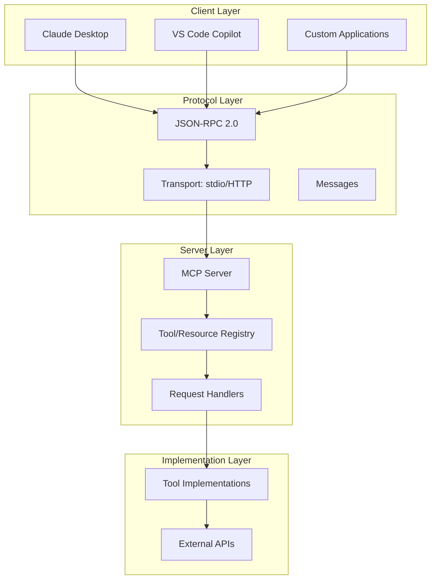
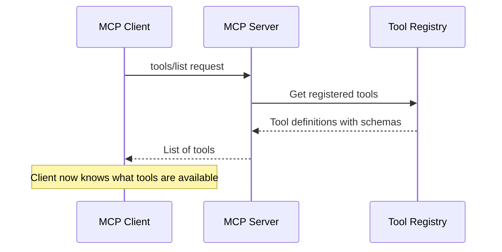
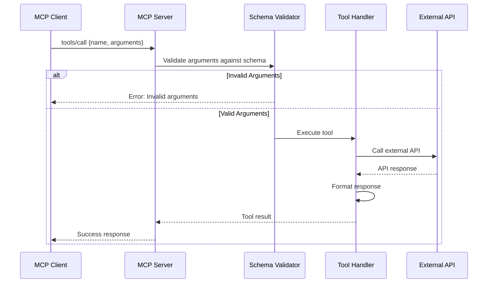

# Model Context Protocol (MCP) - Complete Guide

## Table of Contents
- [What is MCP?](#what-is-mcp)
- [MCP Architecture](#mcp-architecture)
- [MCP Implementation in This Project](#mcp-implementation-in-this-project)
- [MCP Server Setup](#mcp-server-setup)
- [MCP Client Usage](#mcp-client-usage)
- [Tool Definitions](#tool-definitions)
- [Resource Providers](#resource-providers)
- [Claude Desktop Integration](#claude-desktop-integration)
- [Testing MCP Server](#testing-mcp-server)
- [Troubleshooting MCP](#troubleshooting-mcp)

---

## What is MCP?

### Overview
**Model Context Protocol (MCP)** is a standardized protocol that enables AI models (like Claude) to interact with external tools and data sources through a well-defined interface.

### Key Concepts

#### 1. Protocol Foundation
- **Based on:** JSON-RPC 2.0
- **Transport:** stdio, HTTP, WebSocket
- **Schema:** JSON Schema for validation
- **Discovery:** Dynamic tool and resource discovery

#### 2. Core Components


#### 3. Why MCP?

**Without MCP:**
```typescript
// Tight coupling - hard to maintain
async function doGitHubWork() {
  const result = githubTools.createBranch(...);
  // Direct function calls
  // No standardization
  // Can't be used by other AI clients
}
```

**With MCP:**
```typescript
// Loose coupling via protocol
const tools = await mcpClient.listTools();
const result = await mcpClient.callTool('create_branch', {
  branchName: 'feature/new'
});
// Standardized interface
// Works with any MCP client
// Dynamic discovery
```

### MCP vs. Other Approaches

| Aspect | Direct API | MCP Protocol |
|--------|-----------|--------------|
| **Standardization** | Custom per project | Standardized across tools |
| **Discovery** | Hardcoded | Dynamic tool discovery |
| **Validation** | Manual | Schema-based automatic |
| **Reusability** | Project-specific | Works with any MCP client |
| **AI Integration** | Custom code | Native support in Claude, etc. |
| **Maintenance** | Update each integration | Update server once |

---

## MCP Architecture

### Three-Layer Architecture



### Message Flow

#### Tool Discovery Flow


#### Tool Invocation Flow


---

## MCP Implementation in This Project

### Current Status

#### ✅ Implemented
- MCP Server with JSON-RPC protocol
- 6 GitHub integration tools
- 3 resource providers
- Schema validation with Zod
- stdio transport for local development
- MCP client for testing
- Integration test suite

#### 🚧 In Progress
- HTTP transport for remote access
- WebSocket transport for real-time
- Additional tool categories

#### 📋 Planned
- Database tools (query, insert, update)
- File system tools
- Email/notification tools
- Analytics tools

### Directory Structure

```
backend/src/mcp/
├── server/
│   └── index.ts                 # MCP Server implementation
├── client/
│   ├── github-mcp-client.ts    # MCP Client
│   └── test-client.ts          # Test suite
├── github/
│   ├── github.tools.ts         # Tool implementations
│   └── github.service.ts       # GitHub API wrapper
├── schemas/
│   └── github-tools.schema.ts  # Tool schemas
└── github-agent/
    └── index.ts                # Agent integration
```

---

## MCP Server Setup

### Installation

**1. Install Dependencies:**
```bash
cd backend
npm install @modelcontextprotocol/sdk zod
```

**2. Verify Installation:**
```bash
npm list | grep @modelcontextprotocol
# Should show: @modelcontextprotocol/sdk@^0.5.0
```

### Server Implementation

**File: `backend/src/mcp/server/index.ts`**

```typescript
import { Server } from '@modelcontextprotocol/sdk/server/index.js';
import { StdioServerTransport } from '@modelcontextprotocol/sdk/server/stdio.js';
import {
  CallToolRequestSchema,
  ListToolsRequestSchema,
  ListResourcesRequestSchema,
  ReadResourceRequestSchema,
} from '@modelcontextprotocol/sdk/types.js';

// 1. Create server instance
const server = new Server(
  {
    name: 'github-mcp-server',
    version: '1.0.0',
  },
  {
    capabilities: {
      tools: {},      // Supports tools
      resources: {},  // Supports resources
    },
  }
);

// 2. Register tool list handler
server.setRequestHandler(ListToolsRequestSchema, async () => {
  return {
    tools: [
      {
        name: 'create_branch',
        description: 'Create a new GitHub branch',
        inputSchema: {
          type: 'object',
          properties: {
            branchName: {
              type: 'string',
              description: 'Name of the branch to create',
            },
            owner: {
              type: 'string',
              description: 'Repository owner (optional)',
            },
            repo: {
              type: 'string',
              description: 'Repository name (optional)',
            },
            baseBranch: {
              type: 'string',
              description: 'Base branch (default: main)',
            },
          },
          required: ['branchName'],
        },
      },
      // ... more tools
    ],
  };
});

// 3. Register tool call handler
server.setRequestHandler(CallToolRequestSchema, async (request) => {
  const { name, arguments: args } = request.params;

  switch (name) {
    case 'create_branch':
      return await handleCreateBranch(args);
    case 'commit_changes':
      return await handleCommitChanges(args);
    // ... more cases
    default:
      throw new Error(`Unknown tool: ${name}`);
  }
});

// 4. Register resource handlers
server.setRequestHandler(ListResourcesRequestSchema, async () => {
  return {
    resources: [
      {
        uri: 'github://repositories',
        name: 'GitHub Repositories',
        description: 'List of user repositories',
        mimeType: 'application/json',
      },
      // ... more resources
    ],
  };
});

// 5. Start server
async function main() {
  const transport = new StdioServerTransport();
  await server.connect(transport);
  console.error('GitHub MCP Server running on stdio');
}

main().catch(console.error);
```

### Tool Implementation

**File: `backend/src/mcp/github/github.tools.ts`**

```typescript
import { Octokit } from '@octokit/rest';

const github = new Octokit({
  auth: process.env.GITHUB_TOKEN,
});

export async function createBranch(
  branchName: string,
  owner?: string,
  repo?: string,
  baseBranch: string = 'main'
): Promise<BranchResult> {
  try {
    // Get default owner/repo from config
    owner = owner || process.env.GITHUB_OWNER!;
    repo = repo || process.env.GITHUB_REPO!;

    // Get base branch SHA
    const { data: ref } = await github.git.getRef({
      owner,
      repo,
      ref: `heads/${baseBranch}`,
    });

    const baseSha = ref.object.sha;

    // Create new branch
    await github.git.createRef({
      owner,
      repo,
      ref: `refs/heads/${branchName}`,
      sha: baseSha,
    });

    return {
      success: true,
      message: `Branch '${branchName}' created successfully`,
      branch: branchName,
      baseSha,
    };
  } catch (error: any) {
    return {
      success: false,
      message: 'Failed to create branch',
      error: error.message,
    };
  }
}

export async function commitChanges(
  branch: string,
  message: string,
  files: Array<{ path: string; content: string }>,
  owner?: string,
  repo?: string
): Promise<CommitResult> {
  try {
    owner = owner || process.env.GITHUB_OWNER!;
    repo = repo || process.env.GITHUB_REPO!;

    // Get branch reference
    const { data: ref } = await github.git.getRef({
      owner,
      repo,
      ref: `heads/${branch}`,
    });

    const latestCommitSha = ref.object.sha;

    // Get commit tree
    const { data: commit } = await github.git.getCommit({
      owner,
      repo,
      commit_sha: latestCommitSha,
    });

    const baseTreeSha = commit.tree.sha;

    // Create blobs for files
    const blobPromises = files.map(async (file) => {
      const { data: blob } = await github.git.createBlob({
        owner,
        repo,
        content: Buffer.from(file.content).toString('base64'),
        encoding: 'base64',
      });
      return {
        path: file.path,
        mode: '100644' as const,
        type: 'blob' as const,
        sha: blob.sha,
      };
    });

    const tree = await Promise.all(blobPromises);

    // Create new tree
    const { data: newTree } = await github.git.createTree({
      owner,
      repo,
      base_tree: baseTreeSha,
      tree,
    });

    // Create commit
    const { data: newCommit } = await github.git.createCommit({
      owner,
      repo,
      message,
      tree: newTree.sha,
      parents: [latestCommitSha],
    });

    // Update branch reference
    await github.git.updateRef({
      owner,
      repo,
      ref: `heads/${branch}`,
      sha: newCommit.sha,
    });

    return {
      success: true,
      message: `Committed ${files.length} file(s) to ${branch}`,
      commitSha: newCommit.sha,
      filesCommitted: files.map((f) => f.path),
    };
  } catch (error: any) {
    return {
      success: false,
      message: 'Failed to commit changes',
      error: error.message,
    };
  }
}
```

### Configuration

**File: `mcp-config.json`** (Project Root)

```json
{
  "mcpServers": {
    "github": {
      "command": "node",
      "args": ["backend/dist/mcp/server/index.js"],
      "env": {
        "GITHUB_TOKEN": "github_pat_xxxxx",
        "GITHUB_OWNER": "your-username",
        "GITHUB_REPO": "your-repo"
      }
    }
  }
}
```

---

## MCP Client Usage

### Client Implementation

**File: `backend/src/mcp/client/github-mcp-client.ts`**

```typescript
import { Client } from '@modelcontextprotocol/sdk/client/index.js';
import { StdioClientTransport } from '@modelcontextprotocol/sdk/client/stdio.js';
import { spawn } from 'child_process';

export class GitHubMCPClient {
  private client: Client;
  private transport: StdioClientTransport;

  async connect() {
    // Spawn MCP server process
    const serverProcess = spawn('node', [
      'backend/dist/mcp/server/index.js',
    ]);

    // Create transport
    this.transport = new StdioClientTransport({
      readable: serverProcess.stdout,
      writable: serverProcess.stdin,
    });

    // Create client
    this.client = new Client(
      {
        name: 'github-mcp-client',
        version: '1.0.0',
      },
      {
        capabilities: {},
      }
    );

    // Connect client to server
    await this.client.connect(this.transport);

    console.log('Connected to MCP server');
  }

  async listTools() {
    const response = await this.client.listTools();
    return response.tools;
  }

  async callTool(name: string, args: any) {
    const response = await this.client.callTool({
      name,
      arguments: args,
    });
    return response.content;
  }

  async listResources() {
    const response = await this.client.listResources();
    return response.resources;
  }

  async readResource(uri: string) {
    const response = await this.client.readResource({ uri });
    return response.contents;
  }

  async disconnect() {
    await this.client.close();
  }
}
```

### Using the Client

```typescript
// Example usage
async function example() {
  const client = new GitHubMCPClient();

  try {
    // Connect to server
    await client.connect();

    // List available tools
    const tools = await client.listTools();
    console.log('Available tools:', tools.map((t) => t.name));

    // Call create_branch tool
    const result = await client.callTool('create_branch', {
      branchName: 'feature/mcp-integration',
      baseBranch: 'main',
    });

    console.log('Result:', result);

    // Read resource
    const repos = await client.readResource('github://repositories');
    console.log('Repositories:', repos);
  } finally {
    await client.disconnect();
  }
}
```

---

## Tool Definitions

### Complete Tool Catalog

#### 1. create_branch
**Purpose:** Create a new GitHub branch

**Input Schema:**
```typescript
{
  branchName: string;      // Required
  owner?: string;          // Optional, from config
  repo?: string;           // Optional, from config
  baseBranch?: string;     // Optional, default: 'main'
}
```

**Output:**
```typescript
{
  success: boolean;
  message: string;
  branch?: string;
  baseSha?: string;
  error?: string;
}
```

**Example:**
```typescript
await callTool('create_branch', {
  branchName: 'feature/user-auth',
  baseBranch: 'develop',
});
```

#### 2. commit_changes
**Purpose:** Commit file changes to a branch

**Input Schema:**
```typescript
{
  branch: string;          // Required
  message: string;         // Required
  files: Array<{           // Required
    path: string;
    content: string;
  }>;
  owner?: string;
  repo?: string;
}
```

**Output:**
```typescript
{
  success: boolean;
  message: string;
  commitSha?: string;
  filesCommitted?: string[];
  error?: string;
}
```

**Example:**
```typescript
await callTool('commit_changes', {
  branch: 'feature/user-auth',
  message: 'Add user authentication',
  files: [
    {
      path: 'src/auth.ts',
      content: 'export function login() { ... }',
    },
  ],
});
```

#### 3. list_repositories
**Purpose:** List GitHub repositories

**Input Schema:**
```typescript
{
  type?: 'all' | 'owner' | 'member';  // Default: 'all'
  sort?: 'created' | 'updated' | 'pushed' | 'full_name';
}
```

**Output:**
```typescript
{
  success: boolean;
  repositories?: Array<{
    name: string;
    fullName: string;
    description: string | null;
    private: boolean;
    url: string;
    language: string | null;
    stars: number;
    forks: number;
    updatedAt: string;
  }>;
  count?: number;
  error?: string;
}
```

#### 4. get_issues
**Purpose:** Get issues from a repository

**Input Schema:**
```typescript
{
  owner?: string;
  repo?: string;
  state?: 'open' | 'closed' | 'all';  // Default: 'open'
  labels?: string[];
}
```

**Output:**
```typescript
{
  success: boolean;
  issues?: Array<{
    number: number;
    title: string;
    body: string | null;
    state: string;
    labels: string[];
    assignees: string[];
    createdAt: string;
    updatedAt: string;
    url: string;
    author?: string;
  }>;
  count?: number;
  error?: string;
}
```

#### 5. get_merge_conflicts
**Purpose:** Check for merge conflicts between branches

**Input Schema:**
```typescript
{
  baseBranch: string;      // Required
  headBranch: string;      // Required
  owner?: string;
  repo?: string;
}
```

**Output:**
```typescript
{
  success: boolean;
  hasConflicts?: boolean;
  status?: string;
  ahead_by?: number;
  behind_by?: number;
  conflicts?: Array<{
    path: string;
    conflictType: string;
  }>;
  error?: string;
}
```

#### 6. get_errors_from_checks
**Purpose:** Get errors from CI/CD checks

**Input Schema:**
```typescript
{
  ref: string;             // Required (branch or commit SHA)
  owner?: string;
  repo?: string;
}
```

**Output:**
```typescript
{
  success: boolean;
  checks?: Array<{
    name: string;
    status: string;
    conclusion: string;
    errors?: Array<{
      message: string;
      line?: number;
      column?: number;
      severity: string;
    }>;
  }>;
  error?: string;
}
```

---

## Resource Providers

### Resource URIs

#### 1. github://repositories
**Description:** List of user's repositories

**Format:**
```
URI: github://repositories
MimeType: application/json
```

**Response:**
```json
{
  "repositories": [
    {
      "name": "my-repo",
      "fullName": "user/my-repo",
      "description": "My awesome project",
      "private": false,
      "url": "https://github.com/user/my-repo",
      "stars": 42,
      "forks": 7
    }
  ]
}
```

#### 2. github://issues/{owner}/{repo}
**Description:** Issues for a specific repository

**Format:**
```
URI: github://issues/{owner}/{repo}
MimeType: application/json
```

**Example:**
```
URI: github://issues/facebook/react
```

**Response:**
```json
{
  "issues": [
    {
      "number": 12345,
      "title": "Bug in useEffect",
      "state": "open",
      "author": "username",
      "labels": ["bug", "priority-high"]
    }
  ]
}
```

#### 3. github://conflicts/{owner}/{repo}/{base}/{head}
**Description:** Merge conflicts between branches

**Format:**
```
URI: github://conflicts/{owner}/{repo}/{base}/{head}
MimeType: application/json
```

**Example:**
```
URI: github://conflicts/user/repo/main/feature-branch
```

**Response:**
```json
{
  "hasConflicts": true,
  "conflicts": [
    {
      "path": "src/index.ts",
      "conflictType": "modify"
    }
  ]
}
```

---

## Claude Desktop Integration

### Setup Steps

**1. Install Claude Desktop:**
- Download from anthropic.com
- Install and launch

**2. Configure MCP Server:**

**File:** `~/AppData/Roaming/Claude/claude_desktop_config.json` (Windows)  
**File:** `~/Library/Application Support/Claude/claude_desktop_config.json` (Mac)

```json
{
  "mcpServers": {
    "github": {
      "command": "node",
      "args": [
        "C:\\path\\to\\project\\backend\\dist\\mcp\\server\\index.js"
      ],
      "env": {
        "GITHUB_TOKEN": "github_pat_xxxxx",
        "GITHUB_OWNER": "your-username",
        "GITHUB_REPO": "your-repo"
      }
    }
  }
}
```

**3. Restart Claude Desktop**

**4. Verify Integration:**

In Claude chat:
```
"What tools do you have available?"

Claude should list GitHub tools:
- create_branch
- commit_changes
- list_repositories
- get_issues
- get_merge_conflicts
- get_errors_from_checks
```

### Using MCP Tools in Claude

**Example Conversations:**

**Create Branch:**
```
User: "Create a new branch called feature/user-ratings"

Claude: I'll create that branch for you.
[Uses create_branch tool]
✓ Branch 'feature/user-ratings' created successfully from 'main'
```

**Commit Changes:**
```
User: "Commit these changes to the feature/user-ratings branch:
- Add ratings table schema to schema.sql
- Create ratings.service.ts with CRUD operations"

Claude: I'll commit those files for you.
[Uses commit_changes tool]
✓ Committed 2 files to feature/user-ratings
  - database/schema.sql
  - src/ratings.service.ts
```

**Check Issues:**
```
User: "What open issues do we have in the repository?"

Claude: Let me check the open issues.
[Uses get_issues tool]
Found 3 open issues:
1. #42: Fix booking race condition (bug, priority-high)
2. #38: Add user ratings feature (enhancement)
3. #35: Improve error messages (ux)
```

---

## Testing MCP Server

### Test Script

**File: `backend/src/mcp/client/test-client.ts`**

```typescript
import { GitHubMCPClient } from './github-mcp-client';

async function runTests() {
  const client = new GitHubMCPClient();

  try {
    console.log('🔌 Connecting to MCP server...');
    await client.connect();
    console.log('✅ Connected successfully!\n');

    // Test 1: List Tools
    console.log('📋 Test 1: List Tools');
    const tools = await client.listTools();
    console.log(`✅ Found ${tools.length} tools:`);
    tools.forEach((tool) => {
      console.log(`   - ${tool.name}: ${tool.description}`);
    });
    console.log();

    // Test 2: List Resources
    console.log('📋 Test 2: List Resources');
    const resources = await client.listResources();
    console.log(`✅ Found ${resources.length} resources:`);
    resources.forEach((resource) => {
      console.log(`   - ${resource.uri}: ${resource.name}`);
    });
    console.log();

    // Test 3: List Repositories
    console.log('📋 Test 3: List Repositories');
    const reposResult = await client.callTool('list_repositories', {
      type: 'owner',
    });
    console.log('✅ Repositories retrieved');
    console.log(reposResult);
    console.log();

    // Test 4: Get Issues
    console.log('📋 Test 4: Get Issues');
    const issuesResult = await client.callTool('get_issues', {
      state: 'open',
    });
    console.log('✅ Issues retrieved');
    console.log(issuesResult);
    console.log();

    // Test 5: Read Resource
    console.log('📋 Test 5: Read Resource');
    const resourceData = await client.readResource('github://repositories');
    console.log('✅ Resource data retrieved');
    console.log(resourceData);

    console.log('\n🎉 All tests passed!');
  } catch (error) {
    console.error('❌ Test failed:', error);
    process.exit(1);
  } finally {
    await client.disconnect();
  }
}

runTests();
```

### Run Tests

```bash
cd backend

# Build TypeScript
npm run build

# Run tests
npm run mcp:test

# Expected output:
# ✅ Connected successfully!
# ✅ Found 6 tools
# ✅ Found 3 resources
# ✅ Repositories retrieved
# ✅ Issues retrieved
# ✅ Resource data retrieved
# 🎉 All tests passed!
```

---

## Troubleshooting MCP

### Common Issues

#### 1. GITHUB_TOKEN not set
```
Error: Octokit authentication required
```

**Solution:**
```bash
# Generate token at https://github.com/settings/tokens
# Add to backend/.env
GITHUB_TOKEN=github_pat_xxxxxxxxxxxxx

# Restart MCP server
```

#### 2. Cannot connect to MCP server
```
Error: ECONNREFUSED
```

**Solution:**
```bash
# Build backend first
cd backend
npm run build

# Verify dist folder exists
ls dist/mcp/server/index.js

# Check server starts
node dist/mcp/server/index.js
```

#### 3. Tool not found
```
Error: Unknown tool: create_branch
```

**Solution:**
```typescript
// Check tool is registered in server/index.ts
server.setRequestHandler(ListToolsRequestSchema, async () => {
  return {
    tools: [
      {
        name: 'create_branch',  // Must match exactly
        // ...
      }
    ]
  };
});
```

#### 4. Schema validation error
```
Error: Invalid arguments
```

**Solution:**
```typescript
// Check input matches schema
await callTool('create_branch', {
  branchName: 'my-branch',  // Required field
  // Other fields optional
});

// Schema defines:
required: ['branchName']  // This field must be present
```

---

**Last Updated:** 2026-06-11  
**Version:** 1.0.0  
**MCP SDK Version:** 0.5.0
