# Carpooling Platform - Workflow Diagrams

## Table of Contents
- [User Authentication Workflow](#user-authentication-workflow)
- [Route Publishing Workflow](#route-publishing-workflow)
- [Seat Booking Workflow](#seat-booking-workflow)
- [Comment/Chat Workflow](#commentchat-workflow)
- [Travel History Workflow](#travel-history-workflow)
- [MCP Agent Workflow](#mcp-agent-workflow)
- [Development Workflow (SDLC)](#development-workflow-sdlc)
- [Data Flow Diagrams](#data-flow-diagrams)
- [State Transition Diagrams](#state-transition-diagrams)
- [Error Handling Workflows](#error-handling-workflows)

---

## User Authentication Workflow

### Registration Flow
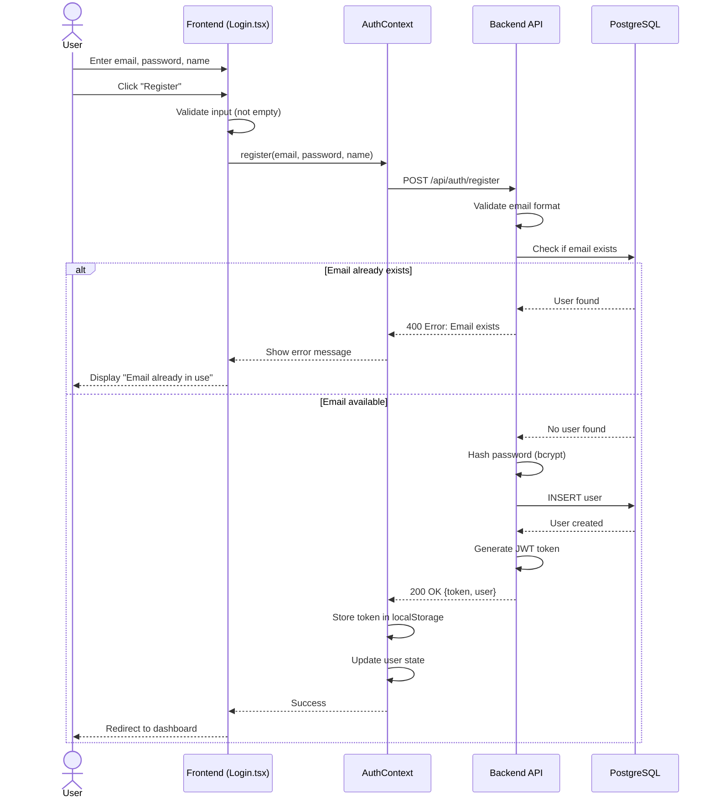
```mermaid
sequenceDiagram
    actor User
    participant UI as Frontend (Login.tsx)
    participant Auth as AuthContext
    participant API as Backend API
    participant DB as PostgreSQL

    User->>UI: Enter email, password, name
    User->>UI: Click "Register"
    UI->>UI: Validate input (not empty)
    UI->>Auth: register(email, password, name)
    Auth->>API: POST /api/auth/register
    API->>API: Validate email format
    API->>DB: Check if email exists
    alt Email already exists
        DB-->>API: User found
        API-->>Auth: 400 Error: Email exists
        Auth-->>UI: Show error message
        UI-->>User: Display "Email already in use"
    else Email available
        DB-->>API: No user found
        API->>API: Hash password (bcrypt)
        API->>DB: INSERT user
        DB-->>API: User created
        API->>API: Generate JWT token
        API-->>Auth: 200 OK {token, user}
        Auth->>Auth: Store token in localStorage
        Auth->>Auth: Update user state
        Auth-->>UI: Success
        UI-->>User: Redirect to dashboard
    end
```

### Login Flow
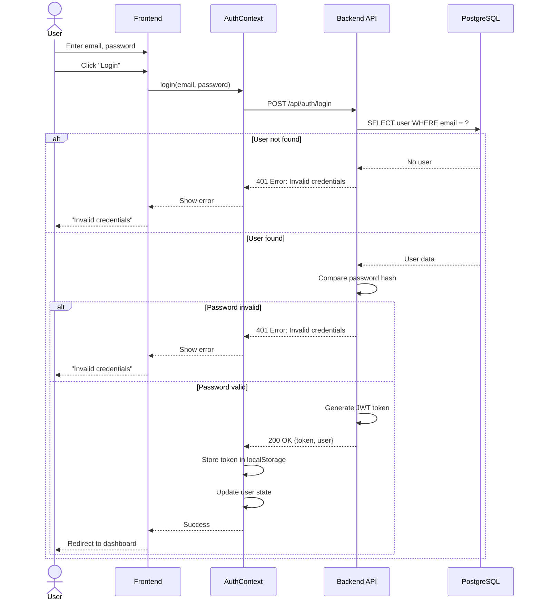
```mermaid
sequenceDiagram
    actor User
    participant UI as Frontend
    participant Auth as AuthContext
    participant API as Backend API
    participant DB as PostgreSQL

    User->>UI: Enter email, password
    User->>UI: Click "Login"
    UI->>Auth: login(email, password)
    Auth->>API: POST /api/auth/login
    API->>DB: SELECT user WHERE email = ?
    alt User not found
        DB-->>API: No user
        API-->>Auth: 401 Error: Invalid credentials
        Auth-->>UI: Show error
        UI-->>User: "Invalid credentials"
    else User found
        DB-->>API: User data
        API->>API: Compare password hash
        alt Password invalid
            API-->>Auth: 401 Error: Invalid credentials
            Auth-->>UI: Show error
            UI-->>User: "Invalid credentials"
        else Password valid
            API->>API: Generate JWT token
            API-->>Auth: 200 OK {token, user}
            Auth->>Auth: Store token in localStorage
            Auth->>Auth: Update user state
            Auth-->>UI: Success
            UI-->>User: Redirect to dashboard
        end
    end
```

### Token Validation Flow
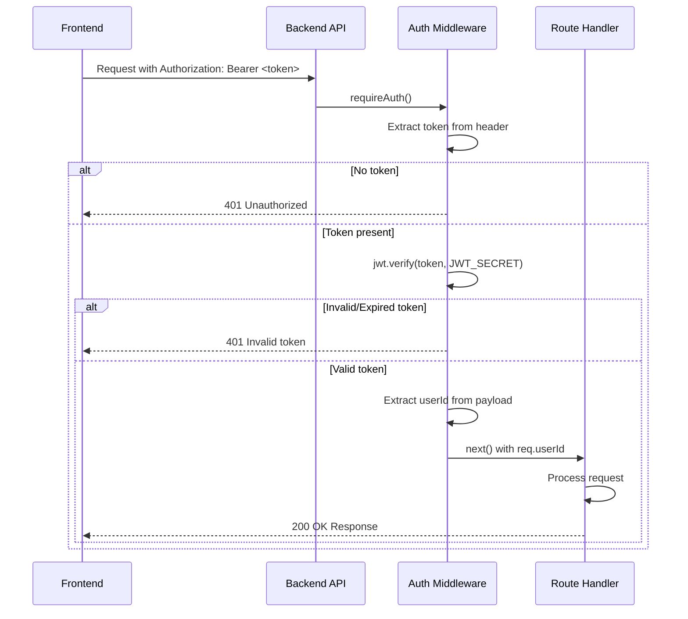
```mermaid
sequenceDiagram
    participant Client as Frontend
    participant API as Backend API
    participant Middleware as Auth Middleware
    participant Handler as Route Handler

    Client->>API: Request with Authorization: Bearer <token>
    API->>Middleware: requireAuth()
    Middleware->>Middleware: Extract token from header
    alt No token
        Middleware-->>Client: 401 Unauthorized
    else Token present
        Middleware->>Middleware: jwt.verify(token, JWT_SECRET)
        alt Invalid/Expired token
            Middleware-->>Client: 401 Invalid token
        else Valid token
            Middleware->>Middleware: Extract userId from payload
            Middleware->>Handler: next() with req.userId
            Handler->>Handler: Process request
            Handler-->>Client: 200 OK Response
        end
    end
```

---

## Route Publishing Workflow

### Complete Route Publishing Flow
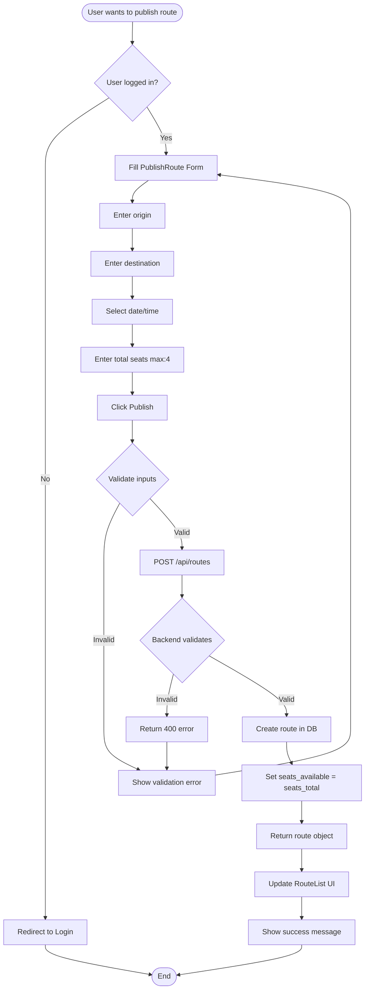
```mermaid
flowchart TD
    Start([User wants to publish route]) --> Login{User logged in?}
    Login -->|No| LoginPage[Redirect to Login]
    LoginPage --> End([End])
    Login -->|Yes| Form[Fill PublishRoute Form]
    
    Form --> InputOrigin[Enter origin]
    InputOrigin --> InputDest[Enter destination]
    InputDest --> InputDateTime[Select date/time]
    InputDateTime --> InputSeats[Enter total seats max:4]
    InputSeats --> Submit[Click Publish]
    
    Submit --> Validate{Validate inputs}
    Validate -->|Invalid| ShowError[Show validation error]
    ShowError --> Form
    
    Validate -->|Valid| SendAPI[POST /api/routes]
    SendAPI --> BackendValidate{Backend validates}
    
    BackendValidate -->|Invalid| APIError[Return 400 error]
    APIError --> ShowError
    
    BackendValidate -->|Valid| CreateRoute[Create route in DB]
    CreateRoute --> SetSeats[Set seats_available = seats_total]
    SetSeats --> ReturnRoute[Return route object]
    ReturnRoute --> UpdateUI[Update RouteList UI]
    UpdateUI --> Success[Show success message]
    Success --> End
```

### Route Creation Sequence
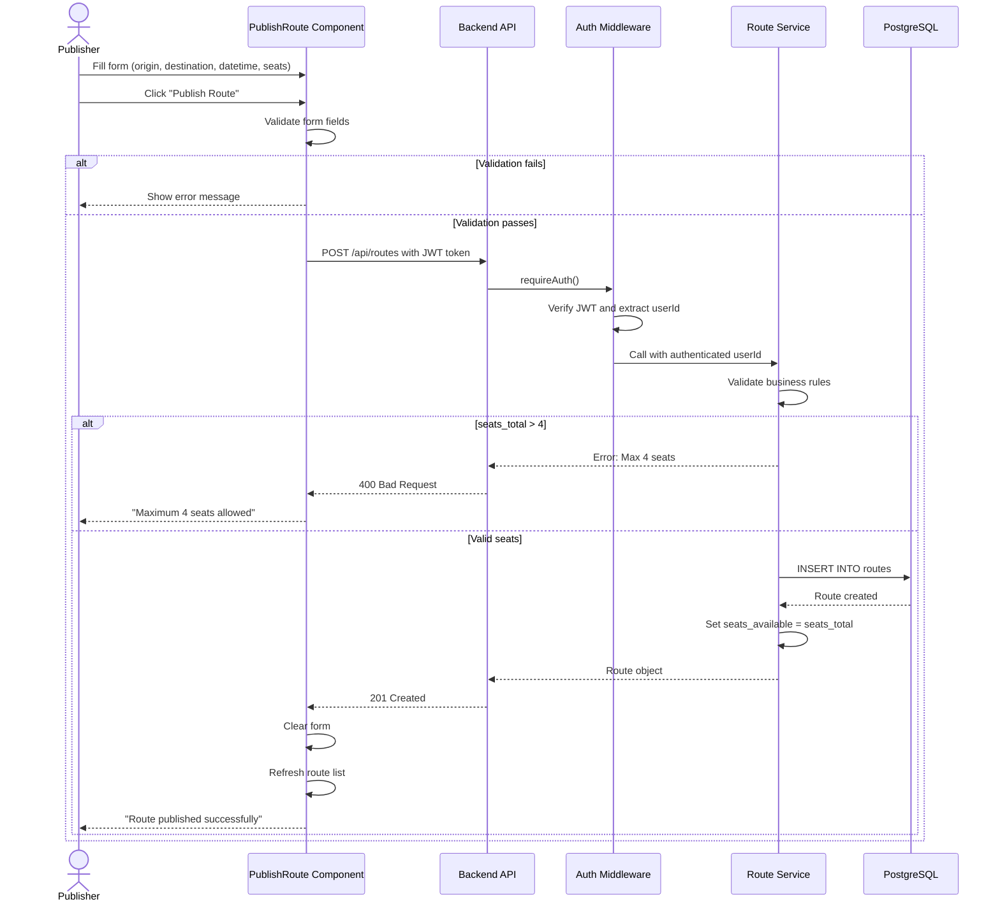
```mermaid
sequenceDiagram
    actor Publisher
    participant UI as PublishRoute Component
    participant API as Backend API
    participant Auth as Auth Middleware
    participant Service as Route Service
    participant DB as PostgreSQL

    Publisher->>UI: Fill form (origin, destination, datetime, seats)
    Publisher->>UI: Click "Publish Route"
    UI->>UI: Validate form fields
    alt Validation fails
        UI-->>Publisher: Show error message
    else Validation passes
        UI->>API: POST /api/routes with JWT token
        API->>Auth: requireAuth()
        Auth->>Auth: Verify JWT and extract userId
        Auth->>Service: Call with authenticated userId
        Service->>Service: Validate business rules
        alt seats_total > 4
            Service-->>API: Error: Max 4 seats
            API-->>UI: 400 Bad Request
            UI-->>Publisher: "Maximum 4 seats allowed"
        else Valid seats
            Service->>DB: INSERT INTO routes
            DB-->>Service: Route created
            Service->>Service: Set seats_available = seats_total
            Service-->>API: Route object
            API-->>UI: 201 Created
            UI->>UI: Clear form
            UI->>UI: Refresh route list
            UI-->>Publisher: "Route published successfully"
        end
    end
```

---

## Seat Booking Workflow

### Booking Flow with Validations
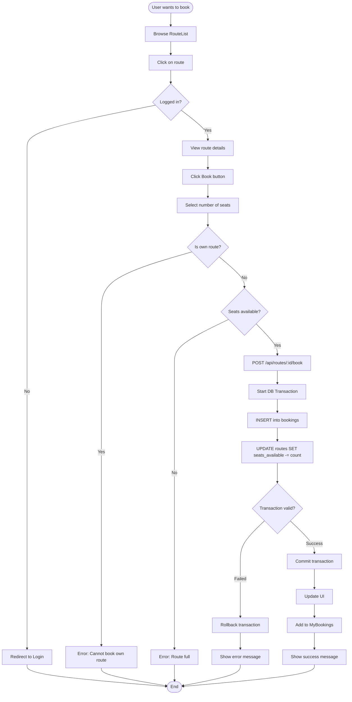
```mermaid
flowchart TD
    Start([User wants to book]) --> ViewRoutes[Browse RouteList]
    ViewRoutes --> SelectRoute[Click on route]
    SelectRoute --> CheckAuth{Logged in?}
    
    CheckAuth -->|No| LoginPage[Redirect to Login]
    LoginPage --> End([End])
    
    CheckAuth -->|Yes| ShowDetails[View route details]
    ShowDetails --> ClickBook[Click Book button]
    ClickBook --> SelectSeats[Select number of seats]
    
    SelectSeats --> CheckSelf{Is own route?}
    CheckSelf -->|Yes| ErrorSelf[Error: Cannot book own route]
    ErrorSelf --> End
    
    CheckSelf -->|No| CheckAvailable{Seats available?}
    CheckAvailable -->|No| ErrorFull[Error: Route full]
    ErrorFull --> End
    
    CheckAvailable -->|Yes| SendBooking[POST /api/routes/:id/book]
    SendBooking --> Transaction[Start DB Transaction]
    
    Transaction --> CreateBooking[INSERT into bookings]
    CreateBooking --> UpdateSeats[UPDATE routes SET seats_available -= count]
    UpdateSeats --> CheckConstraints{Transaction valid?}
    
    CheckConstraints -->|Failed| Rollback[Rollback transaction]
    Rollback --> ErrorDB[Show error message]
    ErrorDB --> End
    
    CheckConstraints -->|Success| Commit[Commit transaction]
    Commit --> UpdateUI[Update UI]
    UpdateUI --> ShowBooking[Add to MyBookings]
    ShowBooking --> Success[Show success message]
    Success --> End
```

### Booking Sequence with Race Condition Handling
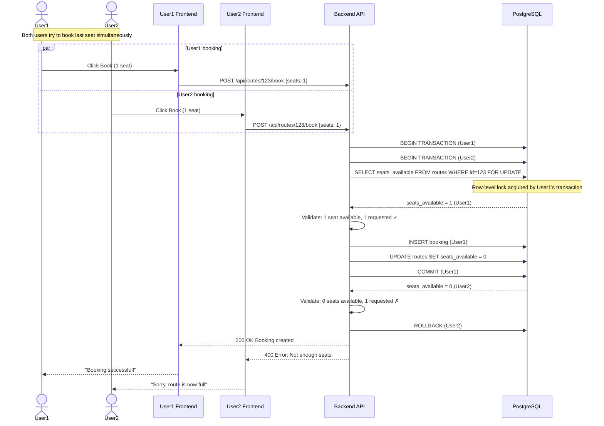
```mermaid
sequenceDiagram
    actor User1
    actor User2
    participant UI1 as User1 Frontend
    participant UI2 as User2 Frontend
    participant API as Backend API
    participant DB as PostgreSQL

    Note over User1,User2: Both users try to book last seat simultaneously
    
    par User1 booking
        User1->>UI1: Click Book (1 seat)
        UI1->>API: POST /api/routes/123/book {seats: 1}
    and User2 booking
        User2->>UI2: Click Book (1 seat)
        UI2->>API: POST /api/routes/123/book {seats: 1}
    end
    
    API->>DB: BEGIN TRANSACTION (User1)
    API->>DB: BEGIN TRANSACTION (User2)
    
    API->>DB: SELECT seats_available FROM routes WHERE id=123 FOR UPDATE
    Note over DB: Row-level lock acquired by User1's transaction
    
    DB-->>API: seats_available = 1 (User1)
    API->>API: Validate: 1 seat available, 1 requested ✓
    API->>DB: INSERT booking (User1)
    API->>DB: UPDATE routes SET seats_available = 0
    API->>DB: COMMIT (User1)
    
    DB-->>API: seats_available = 0 (User2)
    API->>API: Validate: 0 seats available, 1 requested ✗
    API->>DB: ROLLBACK (User2)
    
    API-->>UI1: 200 OK Booking created
    API-->>UI2: 400 Error: Not enough seats
    
    UI1-->>User1: "Booking successful!"
    UI2-->>User2: "Sorry, route is now full"
```

### Self-Booking Prevention
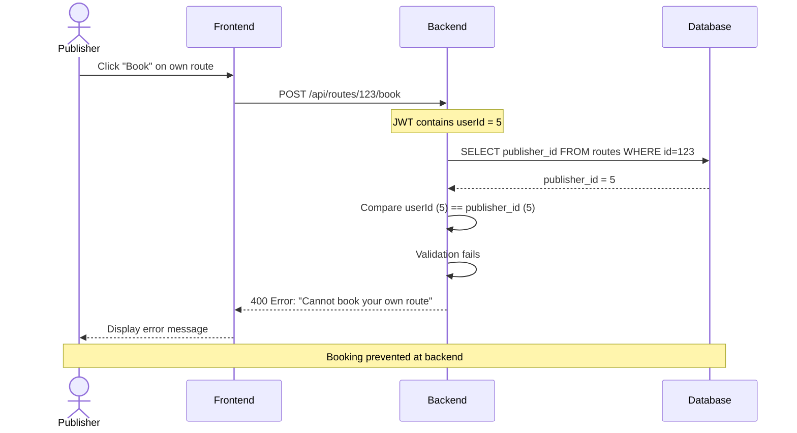
```mermaid
sequenceDiagram
    actor Publisher
    participant UI as Frontend
    participant API as Backend
    participant DB as Database

    Publisher->>UI: Click "Book" on own route
    UI->>API: POST /api/routes/123/book
    Note over API: JWT contains userId = 5
    
    API->>DB: SELECT publisher_id FROM routes WHERE id=123
    DB-->>API: publisher_id = 5
    
    API->>API: Compare userId (5) == publisher_id (5)
    API->>API: Validation fails
    API-->>UI: 400 Error: "Cannot book your own route"
    UI-->>Publisher: Display error message
    
    Note over Publisher,DB: Booking prevented at backend
```

---

## Comment/Chat Workflow

### Comment Posting Flow
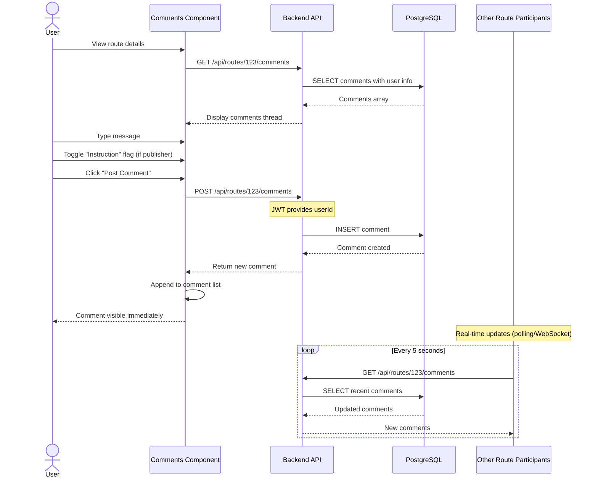
```mermaid
sequenceDiagram
    actor User
    participant UI as Comments Component
    participant API as Backend API
    participant DB as PostgreSQL
    participant OtherUsers as Other Route Participants

    User->>UI: View route details
    UI->>API: GET /api/routes/123/comments
    API->>DB: SELECT comments with user info
    DB-->>API: Comments array
    API-->>UI: Display comments thread
    
    User->>UI: Type message
    User->>UI: Toggle "Instruction" flag (if publisher)
    User->>UI: Click "Post Comment"
    
    UI->>API: POST /api/routes/123/comments
    Note over API: JWT provides userId
    
    API->>DB: INSERT comment
    DB-->>API: Comment created
    API-->>UI: Return new comment
    
    UI->>UI: Append to comment list
    UI-->>User: Comment visible immediately
    
    Note over OtherUsers: Real-time updates (polling/WebSocket)
    loop Every 5 seconds
        OtherUsers->>API: GET /api/routes/123/comments
        API->>DB: SELECT recent comments
        DB-->>API: Updated comments
        API-->>OtherUsers: New comments
    end
```

### Instruction Comment Flow
```mermaid
flowchart TD
    Start([Publisher wants to give instructions]) --> OpenRoute[Open route details]
    OpenRoute --> CheckRole{Is route publisher?}
    
    CheckRole -->|No| RegularComment[Post regular comment]
    RegularComment --> End([End])
    
    CheckRole -->|Yes| WriteInstruction[Write instruction message]
    WriteInstruction --> ToggleFlag[Enable "Instruction" flag]
    ToggleFlag --> PostComment[POST comment with is_instruction=true]
    
    PostComment --> SaveDB[Save to database]
    SaveDB --> DisplaySpecial[Display with special styling]
    DisplaySpecial --> NotifyTravelers[Notify all booked travelers]
    NotifyTravelers --> End
    
    style DisplaySpecial fill:#ffd700
    style NotifyTravelers fill:#90ee90
```

---

## Travel History Workflow

### History Tracking Flow
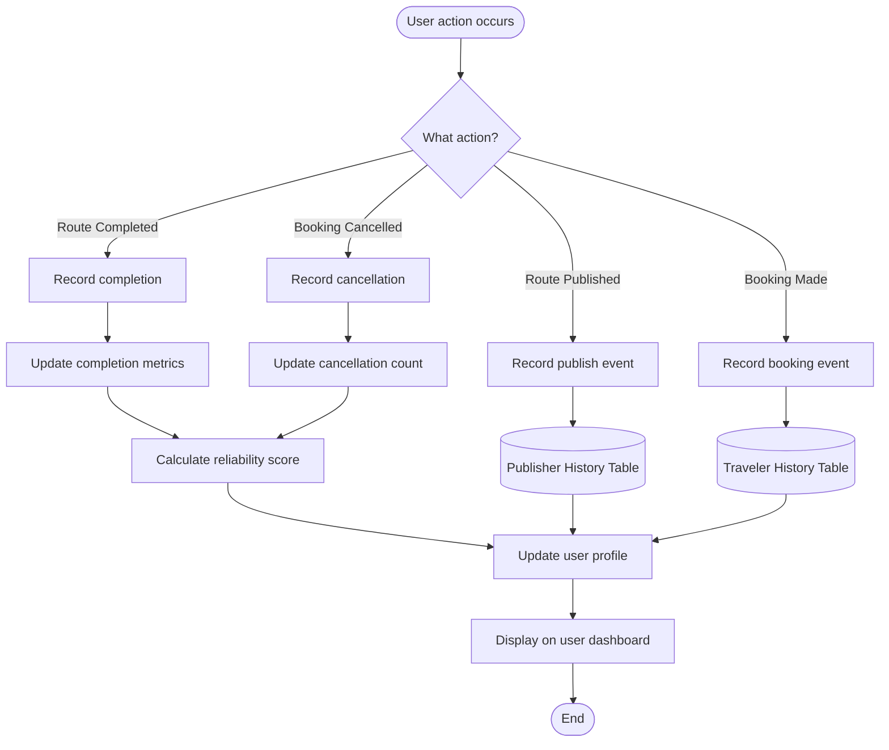
```mermaid
flowchart TD
    Start([User action occurs]) --> ActionType{What action?}
    
    ActionType -->|Route Published| PublishEvent[Record publish event]
    ActionType -->|Booking Made| BookEvent[Record booking event]
    ActionType -->|Route Completed| CompleteEvent[Record completion]
    ActionType -->|Booking Cancelled| CancelEvent[Record cancellation]
    
    PublishEvent --> PublisherHistory[(Publisher History Table)]
    BookEvent --> TravelerHistory[(Traveler History Table)]
    CompleteEvent --> UpdateMetrics[Update completion metrics]
    CancelEvent --> UpdateCancellations[Update cancellation count]
    
    UpdateMetrics --> CalculateReliability[Calculate reliability score]
    UpdateCancellations --> CalculateReliability
    
    CalculateReliability --> UpdateProfile[Update user profile]
    PublisherHistory --> UpdateProfile
    TravelerHistory --> UpdateProfile
    
    UpdateProfile --> DisplayDashboard[Display on user dashboard]
    DisplayDashboard --> End([End])
```

### History Retrieval Flow
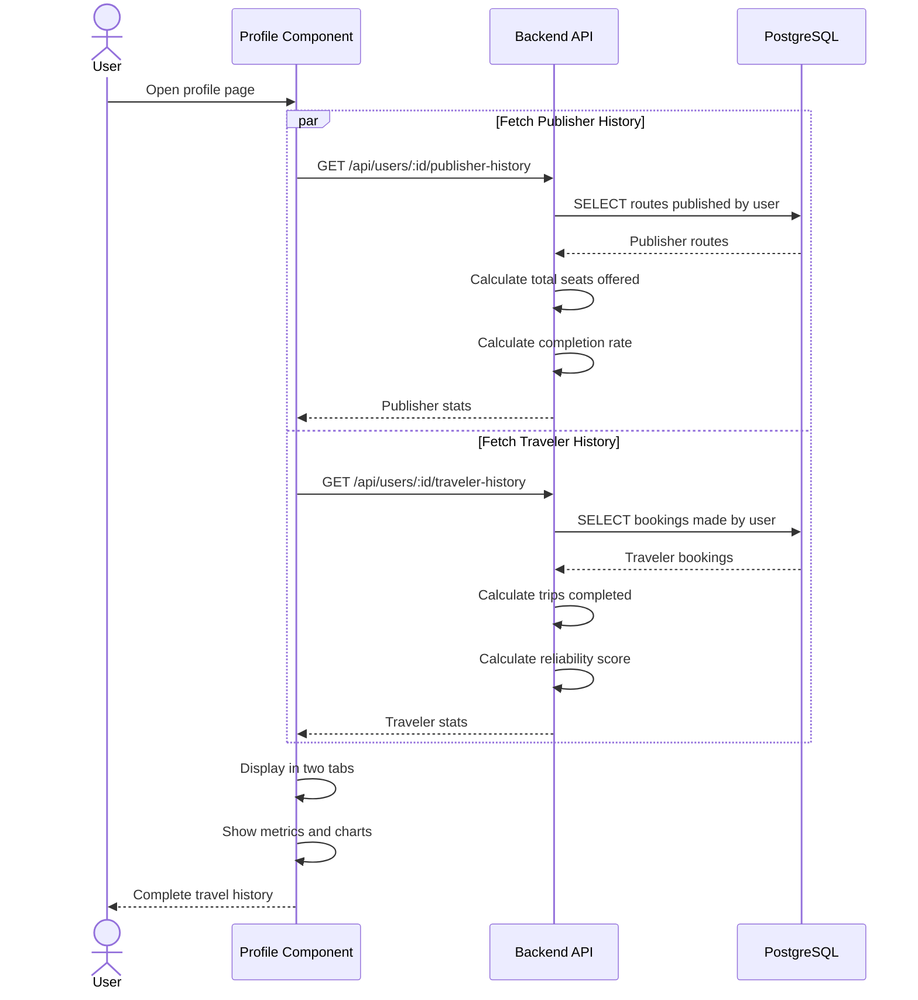
```mermaid
sequenceDiagram
    actor User
    participant UI as Profile Component
    participant API as Backend API
    participant DB as PostgreSQL

    User->>UI: Open profile page
    
    par Fetch Publisher History
        UI->>API: GET /api/users/:id/publisher-history
        API->>DB: SELECT routes published by user
        DB-->>API: Publisher routes
        API->>API: Calculate total seats offered
        API->>API: Calculate completion rate
        API-->>UI: Publisher stats
    and Fetch Traveler History
        UI->>API: GET /api/users/:id/traveler-history
        API->>DB: SELECT bookings made by user
        DB-->>API: Traveler bookings
        API->>API: Calculate trips completed
        API->>API: Calculate reliability score
        API-->>UI: Traveler stats
    end
    
    UI->>UI: Display in two tabs
    UI->>UI: Show metrics and charts
    UI-->>User: Complete travel history
```

---

## MCP Agent Workflow

### MCP Tool Invocation Flow
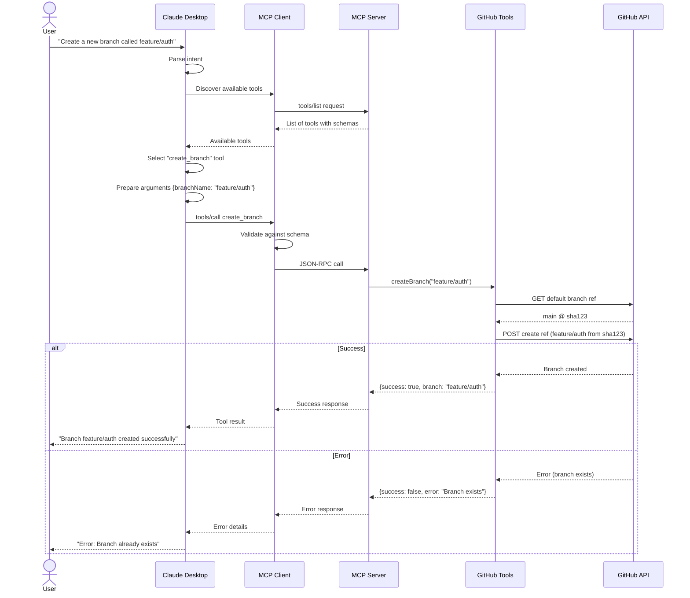
```mermaid
sequenceDiagram
    actor User
    participant Claude as Claude Desktop
    participant MCPClient as MCP Client
    participant MCPServer as MCP Server
    participant Tools as GitHub Tools
    participant GitHub as GitHub API

    User->>Claude: "Create a new branch called feature/auth"
    Claude->>Claude: Parse intent
    Claude->>MCPClient: Discover available tools
    MCPClient->>MCPServer: tools/list request
    MCPServer-->>MCPClient: List of tools with schemas
    MCPClient-->>Claude: Available tools
    
    Claude->>Claude: Select "create_branch" tool
    Claude->>Claude: Prepare arguments {branchName: "feature/auth"}
    Claude->>MCPClient: tools/call create_branch
    
    MCPClient->>MCPClient: Validate against schema
    MCPClient->>MCPServer: JSON-RPC call
    MCPServer->>Tools: createBranch("feature/auth")
    
    Tools->>GitHub: GET default branch ref
    GitHub-->>Tools: main @ sha123
    Tools->>GitHub: POST create ref (feature/auth from sha123)
    
    alt Success
        GitHub-->>Tools: Branch created
        Tools-->>MCPServer: {success: true, branch: "feature/auth"}
        MCPServer-->>MCPClient: Success response
        MCPClient-->>Claude: Tool result
        Claude-->>User: "Branch feature/auth created successfully"
    else Error
        GitHub-->>Tools: Error (branch exists)
        Tools-->>MCPServer: {success: false, error: "Branch exists"}
        MCPServer-->>MCPClient: Error response
        MCPClient-->>Claude: Error details
        Claude-->>User: "Error: Branch already exists"
    end
```

### MCP Resource Access Flow
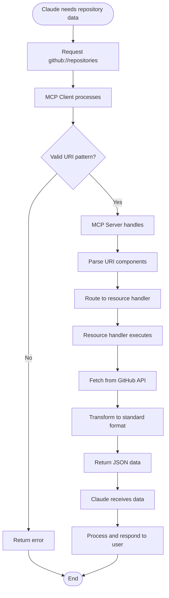
```mermaid
flowchart TD
    Start([Claude needs repository data]) --> RequestResource[Request github://repositories]
    
    RequestResource --> MCPClient[MCP Client processes]
    MCPClient --> ValidateURI{Valid URI pattern?}
    
    ValidateURI -->|No| ErrorInvalid[Return error]
    ErrorInvalid --> End([End])
    
    ValidateURI -->|Yes| MCPServer[MCP Server handles]
    MCPServer --> ParseURI[Parse URI components]
    ParseURI --> RouteToHandler[Route to resource handler]
    
    RouteToHandler --> Handler[Resource handler executes]
    Handler --> FetchGitHub[Fetch from GitHub API]
    FetchGitHub --> Transform[Transform to standard format]
    Transform --> Return[Return JSON data]
    
    Return --> Claude[Claude receives data]
    Claude --> Process[Process and respond to user]
    Process --> End
```

### Complete MCP Architecture Flow
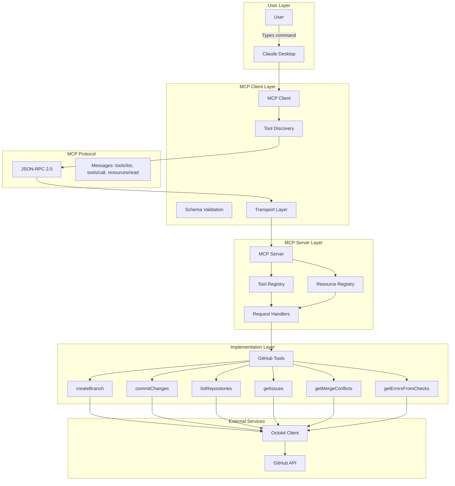
```mermaid
graph TB
    subgraph "User Layer"
        User[User]
        Claude[Claude Desktop]
    end
    
    subgraph "MCP Client Layer"
        MCPClient[MCP Client]
        Discovery[Tool Discovery]
        Validation[Schema Validation]
        Transport[Transport Layer]
    end
    
    subgraph "MCP Protocol"
        JSONRPC[JSON-RPC 2.0]
        Messages[Messages: tools/list, tools/call, resources/read]
    end
    
    subgraph "MCP Server Layer"
        MCPServer[MCP Server]
        ToolRegistry[Tool Registry]
        ResourceRegistry[Resource Registry]
        Handlers[Request Handlers]
    end
    
    subgraph "Implementation Layer"
        GitHubTools[GitHub Tools]
        CreateBranch[createBranch]
        CommitChanges[commitChanges]
        ListRepos[listRepositories]
        GetIssues[getIssues]
        CheckConflicts[getMergeConflicts]
        CheckCI[getErrorsFromChecks]
    end
    
    subgraph "External Services"
        GitHubAPI[GitHub API]
        Octokit[Octokit Client]
    end
    
    User -->|Types command| Claude
    Claude --> MCPClient
    MCPClient --> Discovery
    Discovery --> JSONRPC
    JSONRPC --> Transport
    Transport --> MCPServer
    MCPServer --> ToolRegistry
    MCPServer --> ResourceRegistry
    ToolRegistry --> Handlers
    ResourceRegistry --> Handlers
    Handlers --> GitHubTools
    GitHubTools --> CreateBranch
    GitHubTools --> CommitChanges
    GitHubTools --> ListRepos
    GitHubTools --> GetIssues
    GitHubTools --> CheckConflicts
    GitHubTools --> CheckCI
    CreateBranch --> Octokit
    CommitChanges --> Octokit
    ListRepos --> Octokit
    GetIssues --> Octokit
    CheckConflicts --> Octokit
    CheckCI --> Octokit
    Octokit --> GitHubAPI
```

---

## Development Workflow (SDLC)

### Agent-Based Development Flow
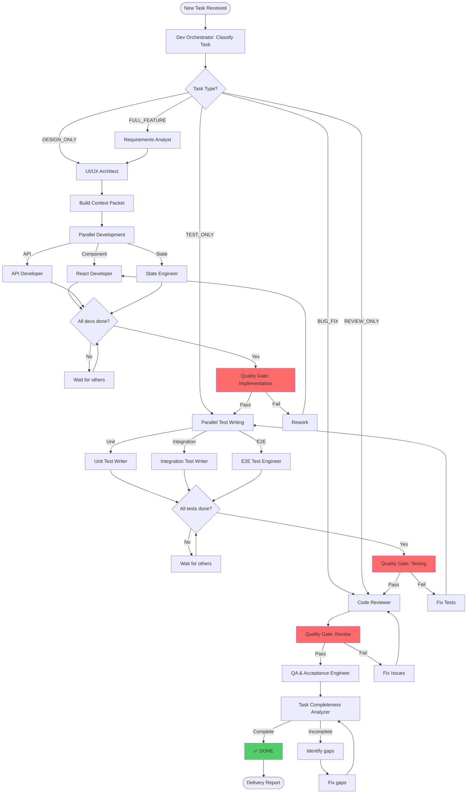
```mermaid
flowchart TD
    Start([New Task Received]) --> Classify[Dev Orchestrator: Classify Task]
    
    Classify --> TaskType{Task Type?}
    
    TaskType -->|FULL_FEATURE| Requirements[Requirements Analyst]
    TaskType -->|BUG_FIX| CodeReview[Code Reviewer]
    TaskType -->|TEST_ONLY| ParallelTests[Parallel Test Writing]
    TaskType -->|REVIEW_ONLY| CodeReview
    TaskType -->|DESIGN_ONLY| UIArchitect[UI/UX Architect]
    
    Requirements --> UIArchitect
    UIArchitect --> ContextPacket[Build Context Packet]
    
    ContextPacket --> ParallelDev[Parallel Development]
    
    ParallelDev -->|Component| ReactDev[React Developer]
    ParallelDev -->|API| APIDev[API Developer]
    ParallelDev -->|State| StateDev[State Engineer]
    
    ReactDev --> Sync1{All devs done?}
    APIDev --> Sync1
    StateDev --> Sync1
    
    Sync1 -->|No| Wait1[Wait for others]
    Wait1 --> Sync1
    
    Sync1 -->|Yes| QualityGate1[Quality Gate: Implementation]
    
    QualityGate1 -->|Pass| ParallelTests
    QualityGate1 -->|Fail| Rework1[Rework]
    Rework1 --> ReactDev
    
    ParallelTests -->|Unit| UnitTest[Unit Test Writer]
    ParallelTests -->|Integration| IntTest[Integration Test Writer]
    ParallelTests -->|E2E| E2ETest[E2E Test Engineer]
    
    UnitTest --> Sync2{All tests done?}
    IntTest --> Sync2
    E2ETest --> Sync2
    
    Sync2 -->|No| Wait2[Wait for others]
    Wait2 --> Sync2
    
    Sync2 -->|Yes| QualityGate2[Quality Gate: Testing]
    
    QualityGate2 -->|Pass| CodeReview
    QualityGate2 -->|Fail| Rework2[Fix Tests]
    Rework2 --> ParallelTests
    
    CodeReview --> QualityGate3[Quality Gate: Review]
    
    QualityGate3 -->|Pass| QA[QA & Acceptance Engineer]
    QualityGate3 -->|Fail| Rework3[Fix Issues]
    Rework3 --> CodeReview
    
    QA --> Completeness[Task Completeness Analyzer]
    
    Completeness -->|Complete| Success[✅ DONE]
    Completeness -->|Incomplete| IdentifyGaps[Identify gaps]
    IdentifyGaps --> Rework4[Fix gaps]
    Rework4 --> Completeness
    
    Success --> End([Delivery Report])
    
    style QualityGate1 fill:#ff6b6b
    style QualityGate2 fill:#ff6b6b
    style QualityGate3 fill:#ff6b6b
    style Success fill:#51cf66
```

### Context Packet Flow
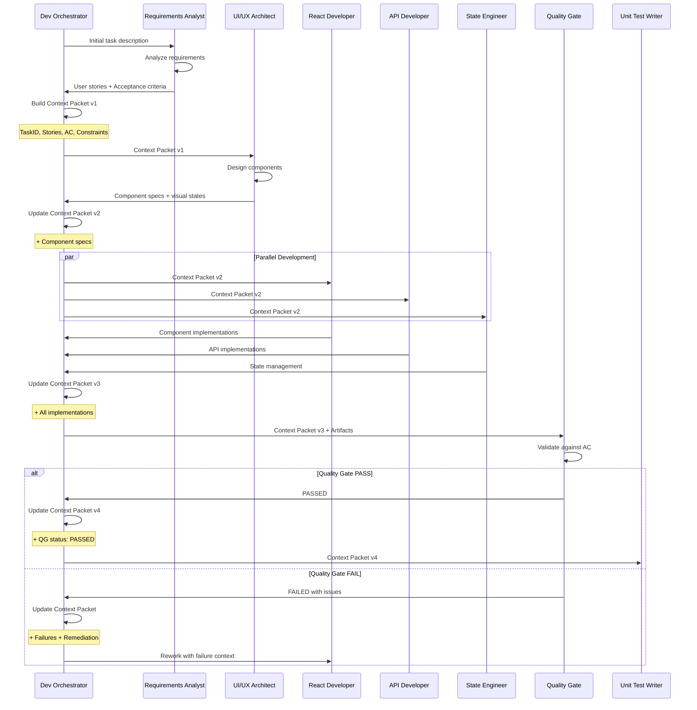
```mermaid
sequenceDiagram
    participant DO as Dev Orchestrator
    participant RA as Requirements Analyst
    participant UI as UI/UX Architect
    participant RD as React Developer
    participant AD as API Developer
    participant SE as State Engineer
    participant QG as Quality Gate
    participant UT as Unit Test Writer
    
    DO->>RA: Initial task description
    RA->>RA: Analyze requirements
    RA->>DO: User stories + Acceptance criteria
    
    DO->>DO: Build Context Packet v1
    Note over DO: TaskID, Stories, AC, Constraints
    
    DO->>UI: Context Packet v1
    UI->>UI: Design components
    UI->>DO: Component specs + visual states
    
    DO->>DO: Update Context Packet v2
    Note over DO: + Component specs
    
    par Parallel Development
        DO->>RD: Context Packet v2
        DO->>AD: Context Packet v2
        DO->>SE: Context Packet v2
    end
    
    RD->>DO: Component implementations
    AD->>DO: API implementations
    SE->>DO: State management
    
    DO->>DO: Update Context Packet v3
    Note over DO: + All implementations
    
    DO->>QG: Context Packet v3 + Artifacts
    QG->>QG: Validate against AC
    
    alt Quality Gate PASS
        QG->>DO: PASSED
        DO->>DO: Update Context Packet v4
        Note over DO: + QG status: PASSED
        DO->>UT: Context Packet v4
    else Quality Gate FAIL
        QG->>DO: FAILED with issues
        DO->>DO: Update Context Packet
        Note over DO: + Failures + Remediation
        DO->>RD: Rework with failure context
    end
```

### Quality Gate Process
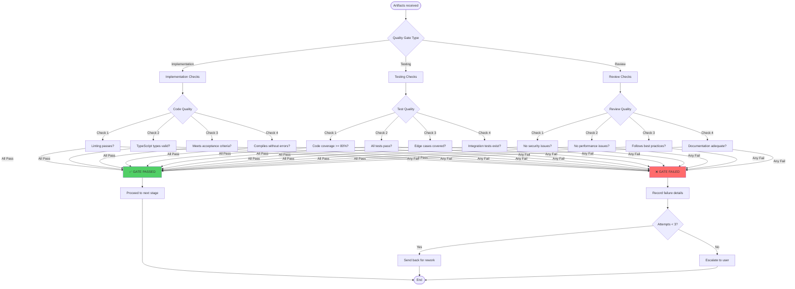
```mermaid
flowchart TD
    Start([Artifacts received]) --> Gate{Quality Gate Type}
    
    Gate -->|Implementation| ImplChecks[Implementation Checks]
    Gate -->|Testing| TestChecks[Testing Checks]
    Gate -->|Review| ReviewChecks[Review Checks]
    
    ImplChecks --> CheckCode{Code Quality}
    CheckCode -->|Check 1| Lint[Linting passes?]
    CheckCode -->|Check 2| Types[TypeScript types valid?]
    CheckCode -->|Check 3| AC[Meets acceptance criteria?]
    CheckCode -->|Check 4| Compile[Compiles without errors?]
    
    TestChecks --> CheckTests{Test Quality}
    CheckTests -->|Check 1| Coverage[Code coverage >= 80%?]
    CheckTests -->|Check 2| Pass[All tests pass?]
    CheckTests -->|Check 3| Edge[Edge cases covered?]
    CheckTests -->|Check 4| Integration[Integration tests exist?]
    
    ReviewChecks --> CheckReview{Review Quality}
    CheckReview -->|Check 1| Security[No security issues?]
    CheckReview -->|Check 2| Performance[No performance issues?]
    CheckReview -->|Check 3| Best[Follows best practices?]
    CheckReview -->|Check 4| Docs[Documentation adequate?]
    
    Lint -->|All Pass| GatePass[✅ GATE PASSED]
    Types -->|All Pass| GatePass
    AC -->|All Pass| GatePass
    Compile -->|All Pass| GatePass
    Coverage -->|All Pass| GatePass
    Pass -->|All Pass| GatePass
    Edge -->|All Pass| GatePass
    Integration -->|All Pass| GatePass
    Security -->|All Pass| GatePass
    Performance -->|All Pass| GatePass
    Best -->|All Pass| GatePass
    Docs -->|All Pass| GatePass
    
    Lint -->|Any Fail| GateFail[❌ GATE FAILED]
    Types -->|Any Fail| GateFail
    AC -->|Any Fail| GateFail
    Compile -->|Any Fail| GateFail
    Coverage -->|Any Fail| GateFail
    Pass -->|Any Fail| GateFail
    Edge -->|Any Fail| GateFail
    Integration -->|Any Fail| GateFail
    Security -->|Any Fail| GateFail
    Performance -->|Any Fail| GateFail
    Best -->|Any Fail| GateFail
    Docs -->|Any Fail| GateFail
    
    GatePass --> NextStage[Proceed to next stage]
    GateFail --> RecordFailures[Record failure details]
    RecordFailures --> CountAttempts{Attempts < 3?}
    CountAttempts -->|Yes| Rework[Send back for rework]
    CountAttempts -->|No| Escalate[Escalate to user]
    
    NextStage --> End([End])
    Rework --> End
    Escalate --> End
    
    style GatePass fill:#51cf66
    style GateFail fill:#ff6b6b
```

---

## Data Flow Diagrams

### Route Discovery Data Flow
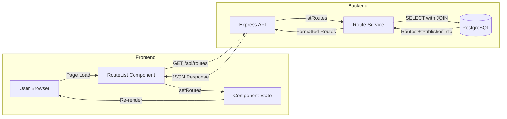
```mermaid
flowchart LR
    subgraph "Frontend"
        User[User Browser]
        RouteList[RouteList Component]
        State[Component State]
    end
    
    subgraph "Backend"
        API[Express API]
        Service[Route Service]
        DB[(PostgreSQL)]
    end
    
    User -->|Page Load| RouteList
    RouteList -->|GET /api/routes| API
    API -->|listRoutes| Service
    Service -->|SELECT with JOIN| DB
    DB -->|Routes + Publisher Info| Service
    Service -->|Formatted Routes| API
    API -->|JSON Response| RouteList
    RouteList -->|setRoutes| State
    State -->|Re-render| User
```

### Booking Data Flow with Validation
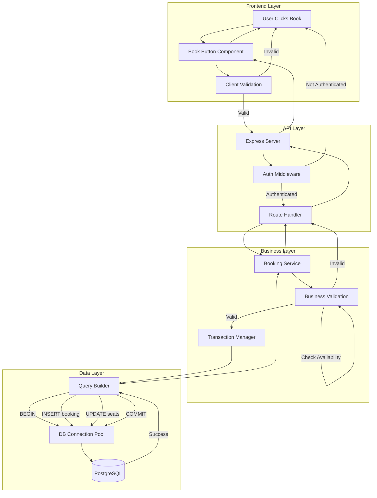
```mermaid
flowchart TD
    subgraph "Frontend Layer"
        UserClick[User Clicks Book]
        BookButton[Book Button Component]
        Validation1[Client Validation]
    end
    
    subgraph "API Layer"
        Express[Express Server]
        AuthMW[Auth Middleware]
        RouteHandler[Route Handler]
    end
    
    subgraph "Business Layer"
        BookingService[Booking Service]
        Validation2[Business Validation]
        Transaction[Transaction Manager]
    end
    
    subgraph "Data Layer"
        QueryBuilder[Query Builder]
        DBConnection[DB Connection Pool]
        PostgreSQL[(PostgreSQL)]
    end
    
    UserClick --> BookButton
    BookButton --> Validation1
    Validation1 -->|Valid| Express
    Validation1 -->|Invalid| UserClick
    
    Express --> AuthMW
    AuthMW -->|Authenticated| RouteHandler
    AuthMW -->|Not Authenticated| UserClick
    
    RouteHandler --> BookingService
    BookingService --> Validation2
    Validation2 -->|Check Self-Booking| Validation2
    Validation2 -->|Check Availability| Validation2
    Validation2 -->|Valid| Transaction
    Validation2 -->|Invalid| RouteHandler
    
    Transaction --> QueryBuilder
    QueryBuilder -->|BEGIN| DBConnection
    DBConnection --> PostgreSQL
    QueryBuilder -->|INSERT booking| DBConnection
    QueryBuilder -->|UPDATE seats| DBConnection
    QueryBuilder -->|COMMIT| DBConnection
    PostgreSQL -->|Success| QueryBuilder
    QueryBuilder --> BookingService
    BookingService --> RouteHandler
    RouteHandler --> Express
    Express --> BookButton
    BookButton --> UserClick
```

---

## State Transition Diagrams

### Route State Transitions
```mermaid
stateDiagram-v2
    [*] --> Draft: Create route form opened
    Draft --> Published: Publisher submits form
    Published --> InProgress: Journey datetime reached
    InProgress --> Completed: All travelers reached destination
    InProgress --> Cancelled: Publisher cancels
    Published --> Cancelled: Publisher cancels before journey
    Completed --> [*]
    Cancelled --> [*]
    
    note right of Published
        seats_available tracked
        Bookings allowed
    end note
    
    note right of InProgress
        Comments active
        Booking disabled
    end note
```

### Booking State Transitions
```mermaid
stateDiagram-v2
    [*] --> Pending: User requests booking
    Pending --> Confirmed: Payment successful (future)
    Pending --> Confirmed: Auto-confirm (current)
    Confirmed --> Completed: Journey completed
    Confirmed --> Cancelled: User cancels
    Pending --> Cancelled: Publisher cancels route
    Completed --> [*]
    Cancelled --> [*]
    
    note right of Confirmed
        Seats deducted
        User in travelers list
    end note
    
    note right of Cancelled
        Seats restored
        Refund processed (future)
    end note
```

### User Session State
```mermaid
stateDiagram-v2
    [*] --> Anonymous: Page load
    Anonymous --> Authenticating: Login/Register attempt
    Authenticating --> Authenticated: Valid credentials
    Authenticating --> Anonymous: Invalid credentials
    Authenticated --> Refreshing: Token expired
    Refreshing --> Authenticated: Refresh successful
    Refreshing --> Anonymous: Refresh failed
    Authenticated --> Anonymous: Logout
    
    note right of Authenticated
        JWT token stored
        All features accessible
    end note
```

---

## Error Handling Workflows

### API Error Handling Flow
```mermaid
flowchart TD
    Request[API Request] --> TryCatch{Try Block}
    
    TryCatch -->|Success| ValidateInput{Input Valid?}
    TryCatch -->|Exception| CatchBlock[Catch Block]
    
    ValidateInput -->|Yes| ProcessRequest[Process Request]
    ValidateInput -->|No| ValidationError[400 Validation Error]
    
    ProcessRequest --> BusinessLogic{Business Logic}
    BusinessLogic -->|Success| Success[200/201 Success]
    BusinessLogic -->|Business Error| BusinessError[400 Business Error]
    BusinessLogic -->|Not Found| NotFound[404 Not Found]
    BusinessLogic -->|Unauthorized| Unauthorized[401 Unauthorized]
    BusinessLogic -->|Forbidden| Forbidden[403 Forbidden]
    
    CatchBlock --> LogError[Log Error]
    LogError --> ErrorType{Error Type?}
    
    ErrorType -->|Database| DBError[500 Database Error]
    ErrorType -->|Network| NetworkError[503 Service Unavailable]
    ErrorType -->|Unknown| GenericError[500 Internal Server Error]
    
    ValidationError --> Response[Send Error Response]
    BusinessError --> Response
    NotFound --> Response
    Unauthorized --> Response
    Forbidden --> Response
    DBError --> Response
    NetworkError --> Response
    GenericError --> Response
    Success --> Response
    
    Response --> Client[Client Receives Response]
    Client --> End([End])
```

### Frontend Error Handling
```mermaid
sequenceDiagram
    participant UI as Component
    participant API as API Client
    participant Backend as Backend API
    participant User as User

    UI->>API: Make request
    API->>Backend: HTTP request
    
    alt Success Response
        Backend-->>API: 200 OK with data
        API-->>UI: Return data
        UI->>UI: Update state
        UI-->>User: Display success
    else Validation Error
        Backend-->>API: 400 Bad Request
        API-->>UI: Throw error with message
        UI->>UI: Catch error
        UI-->>User: Show validation message
    else Authentication Error
        Backend-->>API: 401 Unauthorized
        API-->>UI: Throw auth error
        UI->>UI: Clear token
        UI-->>User: Redirect to login
    else Not Found
        Backend-->>API: 404 Not Found
        API-->>UI: Throw not found error
        UI-->>User: Show "Not found" message
    else Server Error
        Backend-->>API: 500 Internal Server Error
        API-->>UI: Throw server error
        UI->>UI: Log error
        UI-->>User: Show generic error message
    else Network Error
        Note over API,Backend: Network timeout/offline
        API-->>UI: Throw network error
        UI-->>User: Show "Network error" message
    end
```

### Database Transaction Error Handling
```mermaid
flowchart TD
    Start([Transaction Start]) --> Begin[BEGIN TRANSACTION]
    Begin --> Query1[Execute Query 1]
    
    Query1 -->|Success| Query2[Execute Query 2]
    Query1 -->|Error| HandleError1[Catch Error]
    
    Query2 -->|Success| Query3[Execute Query 3]
    Query2 -->|Error| HandleError1
    
    Query3 -->|Success| Validate{Validate Results}
    Query3 -->|Error| HandleError1
    
    Validate -->|Valid| Commit[COMMIT TRANSACTION]
    Validate -->|Invalid| HandleError1
    
    HandleError1 --> Rollback[ROLLBACK TRANSACTION]
    Rollback --> LogError[Log Error Details]
    LogError --> ReleaseConn[Release Connection]
    ReleaseConn --> ThrowError[Throw Error to Caller]
    
    Commit --> ReleaseConn2[Release Connection]
    ReleaseConn2 --> ReturnSuccess[Return Success]
    
    ThrowError --> End([End - Error])
    ReturnSuccess --> End2([End - Success])
```

---

## Performance Optimization Workflows

### Caching Strategy Flow
```mermaid
flowchart TD
    Request[API Request] --> CheckCache{Cache Hit?}
    
    CheckCache -->|Yes| ValidCache{Cache Valid?}
    CheckCache -->|No| FetchDB[Fetch from Database]
    
    ValidCache -->|Yes| ReturnCached[Return Cached Data]
    ValidCache -->|No| FetchDB
    
    FetchDB --> DBQuery[Execute Query]
    DBQuery --> StoreCache[Store in Cache]
    StoreCache --> SetTTL[Set TTL = 60s]
    SetTTL --> ReturnFresh[Return Fresh Data]
    
    ReturnCached --> End([End])
    ReturnFresh --> End
```

---

**Last Updated:** 2026-06-11  
**Version:** 1.0.0  
**Diagram Format:** Mermaid.js
